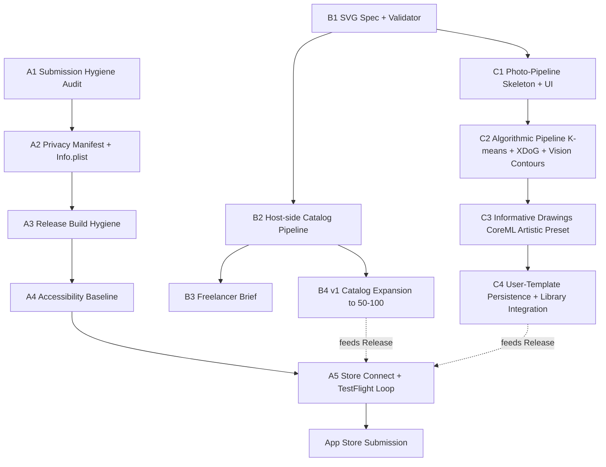

# App Store Readiness Roadmap — Catalog Pipeline, On-Device Photo-to-Template, and Submission Polish

## Overview

Take ColorFlow from its current state (iPad-only SwiftUI app, 11 hand-drawn SVG templates, core canvas + PencilKit + flood-fill working) to an App Store–submittable v1 by executing the full roadmap implied by the research document. The plan spans three tracks that land in sequence:

1. **Submission polish** — everything Apple reviewers and Store Connect require before a binary can be accepted (icon coverage, launch, Info.plist correctness, privacy manifest completeness, crash/log hygiene, accessibility baseline, Store Connect metadata, TestFlight).
2. **Template pipeline tooling + v1 catalog bar** — generation + vectorization + SVG-compliance tooling (not the 500-page production run) plus a credible v1 catalog target sized to launch.
3. **On-device photo-to-template feature** — the K-means + XDoG + `VNDetectContoursRequest` base pipeline *plus* the Informative Drawings CoreML model as the "Artistic" preset, built as the v1 differentiator.

Pricing/monetization is explicitly deferred. The plan is deep, cross-cutting, and gated — Phase A (submission-critical hygiene that applies to any v1) lands first so the app becomes submittable at any time even if later phases slip. Phases B and C raise the content and feature bar before the actual submission.

## Problem Frame

ColorFlow is a premium, distraction-free iPad coloring app positioned against Lake ($39.99/yr) and Pigment ($59.99/yr). The research doc establishes two strategic truths:

- **Hand-drawn-feeling templates are table stakes.** Pure algorithmic template generation hits a quality ceiling too low for a paid app; the competitive bar requires either commissioned art or AI + human cleanup. Bobby's instinct (K-means for closed contours) is reused as the *photo pipeline*, not the catalog pipeline.
- **No premium competitor offers high-quality on-device photo-to-template conversion.** This is the product's real moat, privacy-differentiated ("your photos never leave your device"), and only buildable because Apple's on-device ML stack (Vision, CoreML, Metal Performance Shaders) is now strong enough.

Meanwhile the repo itself isn't yet submission-ready: Info.plist has a subtle orientation mismatch, the privacy manifest is minimal, the launch screen is a bare `<dict/>`, there are `appLogger.fault` + `NSLog` scattered through production code paths that shouldn't remain in a Release build, no App Store screenshots or metadata exist, and the TestFlight loop has not been exercised. A submission attempt today would fail review or produce a low-quality first impression.

## Requirements Trace

**Submission-critical (Phase A):**
- R1. Binary passes App Store Connect validation (icon sizes complete for iPad, launch screen, required Info.plist keys, privacy manifest) without errors or warnings.
- R2. App does not crash on cold launch on current iPadOS 17 and iPadOS 18 on iPad Air (non-Pencil) and iPad Pro (Pencil) — covered by manual + automated smoke.
- R3. Privacy nutrition label is defensible: "No Data Collected" stance is consistent with actual app behavior (no analytics SDKs, no network calls except optional ambient-sound CDN — research doc is explicit that "your photos never leave your device" must hold).
- R4. Production Release build ships without debug-level `fault`/`NSLog` output leaking to Console.app, without `ENABLE_TESTABILITY`, and with a dSYM uploaded for symbolication.
- R5. Accessibility baseline: Dynamic Type respected on text surfaces, minimum 44pt tap targets, VoiceOver labels on tab bar + primary canvas controls, high-contrast line art renders on both light/dark OS preference (app forces dark, but onboarding + alerts respect system contrast).
- R6. Store Connect listing assets complete: app name, subtitle, description, keywords, support URL, marketing URL, privacy policy URL, 13-inch iPad screenshots (6.9" and 12.9" / 13"), preview video optional.
- R7. TestFlight internal-testing loop exercised end-to-end before submission: build uploads, processes, installs on a real iPad, launches, completes a full "open template → color → save → export" loop without crash.

**Catalog + tooling (Phase B):**
- R8. Reproducible template-generation pipeline exists as a `Scripts/` workflow: AI image generation prompt set → VTracer Python batch → SVG post-processor (region IDs, closepath verification, arc-rejection, transform pre-baking, forbidden-element stripping) → drop directory → `templates.json` regeneration.
- R9. SVG specification document exists (internal + freelancer-facing): parser constraints, closed-contour rule, no arcs, no gradients/filters, `viewBox` required, region ID convention, file-size and path-count targets. Enforceable via the post-processor's validator.
- R10. v1 catalog target — concrete, credible number of templates (not 500, but substantially more than today's 11) shipped in the submitted build, spanning at least 5 of the research doc's demand categories.
- R11. Human-cleanup freelancer brief exists so the post-launch scale-out to 500 doesn't block v1 ship.

**Photo-to-template feature (Phase C):**
- R12. User can pick or shoot a photo, pre-validation runs (resolution/contrast/blur), pipeline processes in 2–5s on A16 with stepped progress UI ("Analyzing image… → Extracting edges… → Creating regions… → Building template…"), result is saved as a `Template` the user can open in the canvas.
- R13. Three base-pipeline presets work: Simple (k=5–8), Detailed (k=12–20), Bold Outlines (HED-style dilated edges); plus one neural preset: Artistic (Informative Drawings CoreML).
- R14. Privacy invariant holds: no photo bytes leave the device. Auditable through code-path review and Network Link Conditioner test (airplane mode still works end-to-end).
- R15. Produced SVGs pass the same post-processor validator as the curated catalog, so the canvas renders them identically to hand-authored templates.
- R16. Memory stays under a safe ceiling on a 6GB iPad (research flags ~6GB as the constraining model); the Informative Drawings model is loaded lazily and released after inference; no two large models co-resident.

## Scope Boundaries

- **Out of scope: actual production of 500 templates.** The plan delivers the pipeline and a v1 catalog target, not the full run. Scaling to 500 is a post-launch content initiative.
- **Out of scope: pricing, StoreKit, IAP, subscriptions.** User deferred this. Plan assumes a standard free or paid-app submission flow and leaves the specific price + StoreKit wiring to a later plan.
- **Out of scope: non-iPad targets.** `TARGETED_DEVICE_FAMILY="2"` stays. No iPhone or Mac Catalyst layouts.
- **Out of scope: SVGKit revival.** The research doc nowhere calls for SVGKit; the in-house `SVGParser` + `TemplateRenderer` is the production path. `OTHER_LDFLAGS=""` stays.
- **Out of scope: swapping the PencilKit-based canvas for a custom renderer.** Canvas stays as-is. The photo pipeline produces `Template` entries consumable by the existing canvas.
- **Out of scope: VTracer Rust FFI bridge or GPL'd Swift Potrace.** Research flags both as risky; the plan locks in `VNDetectContoursRequest` as the on-device vectorizer to avoid licensing and build-chain complexity. Revisit post-launch only if quality is insufficient.
- **Out of scope: Marvel-style licensed IP, external-artist royalty-share, or Pigment-scale catalog economics.** The plan is about getting v1 out the door, not a content subscription business.
- **Out of scope: localization beyond English.** `CFBundleDevelopmentRegion=en` is fine for v1.

## Context & Research

### Relevant code and patterns

- `ColorFlow/App/ColorFlowApp.swift` — `@main`, forces `.dark`, configures `UITabBarAppearance` / `UINavigationBarAppearance`, presents the single `CanvasView` via `galleryViewModel.openedProject`. Currently calls `appLogger.fault(...)` and `NSLog(...)` at init time — both must be gated to Debug only for submission.
- `ColorFlow/ViewModels/CanvasViewModel.swift` — `@MainActor`, owns `PKDrawing`, `BrushSettings`, `backgroundColor`, `templateImage`, `fillLayerImage`, and the `FillAction` undo/redo stacks. This is the integration seam for photo-pipeline-produced templates: the photo feature must produce a `Template` + `TemplateGeometry` the existing `loadTemplate()` path can consume unchanged.
- `ColorFlow/Services/SVGParser.swift` — strict SVG parser: no arcs, only `translate(x,y)` transforms, `viewBox` required. Every catalog pipeline SVG and every photo-feature SVG must satisfy this, and the validator should reject anything that won't.
- `ColorFlow/Services/TemplateRenderer.swift` — rasterizes line art + fills. Existing caller for any new pipeline output.
- `ColorFlow/Utilities/FloodFill.swift` + `FillBitmap` — raster fallback; photo pipeline uses `TemplateGeometry.region(at:)` for vector hit-testing once SVG is produced, so existing tap-to-fill path works without change.
- `ColorFlow/Models/Template.swift` — has a hardcoded `bundledTemplates` fallback. Any catalog growth (Phase B) must update both `Resources/templates.json` *and* the fallback array, and user-generated photo templates need a separate code path that doesn't require editing this file (they live in `Documents/`, not the bundle).
- `ColorFlow/Services/StorageService.swift` — `Documents/projects.json` + per-project subdirectories. Photo-pipeline-produced templates add a new persistence concern: user-generated templates themselves need a directory distinct from `projects/` (a template ≠ a project).
- `project.yml` — XcodeGen source of truth. Release config already sets `DEBUG_INFORMATION_FORMAT: dwarf-with-dsym`, `VALIDATE_PRODUCT: "YES"`, `ENABLE_TESTABILITY: "NO"`. Preserve these. Adding CoreML models and Metal shaders requires new `resources:` entries.
- `ColorFlow/Info.plist` — has `NSPhotoLibraryAddUsageDescription`; will need `NSPhotoLibraryUsageDescription` and `NSCameraUsageDescription` when the photo feature adds read/capture. Also has an orientation key mismatch worth fixing: base `UISupportedInterfaceOrientations` is portrait-only while `~ipad` variant supports all four — convention is base should mirror the device variant for iPad-only apps.
- `ColorFlow/PrivacyInfo.xcprivacy` — currently declares only `NSPrivacyAccessedAPICategoryUserDefaults` (CA92.1). The photo feature and export flow will introduce additional Required Reason API categories (file timestamp, disk space, system boot time are the usual suspects from `Date`/`FileManager`/`ProcessInfo` usage). Manifest must be audited and completed against actual binary usage before submission.
- `ColorFlow/Assets.xcassets/AppIcon.appiconset/` — icon PNGs appear present; `Contents.json` needs verification against iPadOS 17+ icon size requirements (1024 marketing, 167 iPad Pro, 152 iPad, 80/58/40/29/20 notification/spotlight/settings at @2x).

### Institutional learnings

- No `docs/solutions/` directory exists yet in this repo. This plan creates one as part of documentation impact (capturing submission pitfalls, privacy-manifest gotchas, CoreML model-loading patterns that survive review).

### External references

- **Source research document (origin):** `/Users/prateekranka/Downloads/compass_artifact_wf-3dafcfeb-f041-4cee-a580-629628bc0fe3_text_markdown.md` (`research/compass_colorflow_templates.md` if copied into the repo). Parts 2 and 3 are the primary inputs to Phases B and C.
- Apple Vision framework docs: `VNDetectContoursRequest` (iOS 14+), `VNGenerateForegroundInstanceMaskRequest` (iOS 17+), `VNGeneratePersonSegmentationRequest`.
- Metal Performance Shaders: `MPSImageGaussianBlur`, `MPSImageMorphologyMinimum`/`Maximum`.
- Core Image: `CIGaussianBlur`, `CIColorControls`, `CIColorThreshold` (iOS 15+).
- VTracer (MIT) — used host-side in the catalog pipeline, not shipped in the app binary.
- `carolineec/informative-drawings` (CVPR 2022) — neural line-art model; ONNX ~17MB, CoreML-converted ~50–150MB depending on config.
- Apple privacy manifest docs: Required Reason API categories (`CA92.1`, `C617.1`, `35F9.1`, `3B52.1`, `E174.1`) and the `PrivacyInfo.xcprivacy` schema.
- App Store Review Guidelines sections 2.1 (performance), 4.0 (design), 5.1.1 (data collection), 5.1.2 (data use).

## Key Technical Decisions

- **Phase gating, not strict waterfall.** Phase A (submission hygiene) is the only phase that *must* ship before any App Store submission attempt. Phase B and Phase C each independently unlock a richer v1 but don't block one another — if the photo feature slips, Phase A + Phase B catalog growth is still a submittable v1. This trades pure dependency ordering for shippability optionality.
- **`VNDetectContoursRequest` is the on-device vectorizer for v1.** Rationale: Swift Potrace ports are GPL v2 (App Store poison without going open source). VTracer via Rust FFI is technically superior but adds cross-compilation, FFI-bridge maintenance, and binary-size cost. Vision's contour detection is first-party, free of licensing risk, and returns `CGPath` objects that serialize directly to the SVG subset the parser already accepts. Quality gap is acceptable for v1; VTracer FFI is a post-launch optimization if user feedback demands better line quality.
- **Informative Drawings is the only bundled neural model in v1.** Rationale: research ranks it top for line-art quality, and a single bundled model keeps the app binary < ~200MB while still delivering the "Artistic" premium preset. HED is faster but lower-quality — the base algorithmic pipeline already covers the fast path. SAM2 Tiny is too slow. U²-Net and DeepLabV3 are preprocessing optimizations that can ship in later versions; skipping them keeps memory budget tight on 6GB iPads.
- **CoreML model loading is strictly sequential, never concurrent.** A single `PhotoPipelineService` owns model lifecycle: load on pipeline start, release before returning the result. This respects the research's explicit 6GB memory warning and prevents the ANE crashes the research flags for Vision Transformers at 768×768+.
- **Photo pipeline output uses the same `Template` + SVG surface as the bundled catalog.** Rationale: reuses the entire `CanvasViewModel` path (loading, rendering, flood fill, export, save). Means the post-processor validator is the single gate for both pipelines — what it accepts is what the canvas can render.
- **User-generated templates live in `Documents/UserTemplates/` and are distinct from `Projects/`.** A template describes line art + regions (no fills yet); a project is a user's coloring of a template. Mixing them in `projects.json` would corrupt the gallery semantics. Two indexes: `projects.json` (existing) and `user_templates.json` (new).
- **SVG catalog pipeline runs host-side in Python, not in-app.** VTracer, svgpathtools, lxml are all Python ecosystem. Outputs check into `ColorFlow/Resources/Templates/`. No runtime bundling of Python into the app.
- **Dark-mode lock stays.** Research doesn't challenge it; accessibility work respects system dynamic-type + contrast but the palette itself remains fixed. If App Store review pushes back on the forced-dark choice, fall-back is to add a `ColorScheme` toggle in settings — tracked as a known risk, not a v1 requirement.
- **The "No Data Collected" privacy label is load-bearing for positioning.** Every Phase C and Phase B decision is evaluated against whether it breaks that claim. No analytics SDK lands in v1. Ambient-sound streaming (if any today) must either be fully bundled or explicitly disclosed — audit during Phase A.
- **Catalog growth for v1 target: 50 templates minimum, 100 stretch.** Rationale: the research recommends 500 eventually but ties it to a multi-month freelancer engagement. 11 (today) is too thin for a paid coloring app listing. 50 across 5+ categories is a credible first-impression catalog; 100 is comfortable. The pipeline itself is sized for 500, so this is a scheduling call, not a capacity call.

## Open Questions

### Resolved during planning

- *Is the photo feature v1 or v2?* — v1. User chose "Base pipeline + Informative Drawings."
- *Which vectorizer for on-device?* — `VNDetectContoursRequest`. Licensing and ecosystem fit dominate the quality gap for v1.
- *Do we need SVGKit?* — No. In-house parser stays. `OTHER_LDFLAGS` stays empty.
- *Do we produce all 500 templates before submission?* — No. Tooling ships; 50–100 v1 catalog ships; 500 is a post-launch content initiative.
- *Pricing / IAP / subscription?* — Deferred to a separate plan.
- *SVG quality contract — who's authoritative?* — The post-processor Python validator plus a Swift-side parity test that runs every SVG through `SVGParser.parse` in CI. Both must accept every shipped SVG.

### Deferred to implementation

- *Exact CoreML conversion knobs (input size, precision, compute-unit pin) for Informative Drawings.* Depends on measured latency vs quality tradeoff on a real iPad. Spike during Phase C1; settle before Phase C3.
- *Whether `UISupportedInterfaceOrientations` base key needs all four orientations or portrait-only.* iPad-only apps typically mirror the `~ipad` variant; verify against Store Connect validation and user testing in multi-tasking (Split View) before finalizing.
- *Which Required Reason API codes actually apply.* Depends on a static-analysis pass of `Date`, `FileManager`, `ProcessInfo`, `UserDefaults`, `NSUnarchiver`, etc. usage — catalog per Apple's spec during Phase A.
- *Whether the "Bold Outlines" HED variant justifies bundling HED-CoreML or can be approximated by aggressive morphological dilation on the base XDoG output.* Defer until A/B quality comparison post-Phase-C2.
- *Storage cap and eviction policy for user-generated templates.* Product question — should 500 user templates delete the oldest, or just fill disk? Decide during Phase C4.
- *Whether to route ambient-sound assets through a CDN or bundle them.* If bundled, no network usage and privacy claim is airtight. If CDN, needs `NSPrivacyAccessedAPICategoryDiskSpace` or similar + a privacy-label entry. Audit during Phase A2.

## High-Level Technical Design

> *This illustrates the intended approach and is directional guidance for review, not implementation specification. The implementing agent should treat it as context, not code to reproduce.*

### Phase relationship (dependency graph)



### Photo pipeline stage sketch (informational)

```
Photo → Preprocess (bilateral/gaussian blur + contrast)
      → Segment (K-means, k varies by preset)
      → Edges (XDoG via Metal compute  OR  Informative Drawings CoreML for Artistic)
      → Morph cleanup (MPS dilation/erosion)
      → Threshold (CIColorThreshold)
      → Contour detection (VNDetectContoursRequest → CGPath)
      → SVG assembly (CGPath → SVG path string with region-N ids)
      → Validator (same Python spec, embedded as Swift check)
      → Template + TemplateGeometry
      → CanvasViewModel.loadTemplate()
```

All stages run on-device; the boundary between algorithmic and neural presets is Stage 3 only.

### Catalog pipeline (host-side) sketch (informational)

```
Prompt set → SDXL/Flux + ColoringBook LoRA → raster PNGs
PNGs → VTracer Python (spline, hierarchical stacked) → SVGs
SVGs → post-processor:
        - assign id="region-N"
        - verify paths end with Z
        - reject any with A/a arc commands
        - pre-bake non-translate transforms
        - strip filters/masks/gradients
        - validate viewBox
SVGs → freelancer cleanup queue (flagged subset) → validated SVGs
Validated SVGs → ColorFlow/Resources/Templates/
                + templates.json regenerated
                + Template.bundledTemplates fallback updated
Parity check → every SVG must parse via SVGParser.parse in Swift CI
```

## Implementation Units

Three phases, 12 units total. Phase A is strictly ordered (each unit unblocks the next). Phase B and Phase C can run in parallel after B1 exists.

### Phase A — Submission hygiene (blocks any submission)

- [ ] **Unit A1: Submission-readiness audit and crash baseline**

**Goal:** Produce a single audit document listing every submission blocker in the current repo, then fix the easy ones inline. Establish a crash-free cold-launch baseline on at least two iPad models (Pencil and non-Pencil).

**Requirements:** R1, R2

**Dependencies:** None

**Files:**
- Create: `docs/solutions/2026-04-app-store-submission-audit.md`
- Modify: `ColorFlow/Info.plist` (orientation key mismatch fix)
- Modify: `ColorFlow/Assets.xcassets/AppIcon.appiconset/Contents.json` (verify sizes complete)
- Test: `ColorFlowTests/InfoPlistValidationTests.swift` (new, parse-time assertions)

**Approach:**
- Walk Info.plist, PrivacyInfo.xcprivacy, entitlements, project.yml against Apple's current submission checklist; record every delta.
- Confirm AppIcon.appiconset has all iPadOS 17+ required sizes with correct filenames and `Contents.json` entries; the appiconset directory currently contains both `AppIcon-*` and `Icon-*` naming conventions — pick one set and reconcile.
- Resolve the base vs `~ipad` `UISupportedInterfaceOrientations` mismatch; choose the option that survives Split View without crashing.
- Cold-launch the app on iPad Air (no Pencil) and iPad Pro (Pencil) simulators and at least one real device; record any launch-path issues.

**Patterns to follow:**
- Audit doc format: use a table with `Issue | File | Severity (blocker/major/minor) | Fix owner (this unit/later unit/deferred)`.

**Test scenarios:**
- Integration: cold-launch on iPad Air sim → reaches `MainTabView` in < 3s without crash.
- Integration: cold-launch on iPad Pro sim → reaches `MainTabView` in < 3s without crash.
- Happy path: `InfoPlistValidationTests` asserts required keys (`UILaunchScreen`, `UISupportedInterfaceOrientations`, `CFBundleDisplayName`, `NSPhotoLibraryAddUsageDescription`) exist.
- Edge case: `InfoPlistValidationTests` asserts no deprecated keys present (e.g., `UIRequiresPersistentWiFi` absent, `UIPrerenderedIcon` absent).

**Verification:**
- Audit doc committed with itemized issue list; every "blocker" row has a unit in this plan that addresses it.
- Cold-launch baseline documented (screenshot + time-to-first-frame) for both device classes.
- `xcodebuild archive` succeeds locally without validation errors.

---

- [ ] **Unit A2: Privacy manifest completeness and Info.plist purpose strings**

**Goal:** Make `PrivacyInfo.xcprivacy` truthful and complete against the app's actual API usage, and add every purpose string the current + upcoming code paths require. This is the unit that locks in the "No Data Collected" privacy label.

**Requirements:** R1, R3, R14 (forward-looking for Phase C)

**Dependencies:** A1

**Files:**
- Modify: `ColorFlow/PrivacyInfo.xcprivacy`
- Modify: `ColorFlow/Info.plist`
- Create: `docs/solutions/2026-04-privacy-manifest-audit.md`
- Test: `ColorFlowTests/PrivacyManifestTests.swift` (new)

**Approach:**
- Enumerate every Required Reason API the app calls today: `UserDefaults` (CA92.1 present), `FileManager` timestamp APIs, `ProcessInfo.systemUptime`, `Date` on-disk-timestamps, etc. Add the correct reason codes.
- Add `NSPhotoLibraryUsageDescription` (read) and `NSCameraUsageDescription` — the photo feature in Phase C needs both; adding them in A2 means Phase C doesn't ship a new permission prompt blocker.
- Document the privacy-label mapping (nutrition label answers) alongside the manifest, so the Store Connect form can be filled accurately in A5.
- Confirm no third-party SDKs are present that would require their own privacy manifest.

**Patterns to follow:**
- Apple's own guidance doc on Required Reason API categories; one dict entry per category.
- Existing `NSPrivacyAccessedAPICategoryUserDefaults` entry as a schema template.

**Test scenarios:**
- Happy path: `PrivacyManifestTests` parses `PrivacyInfo.xcprivacy` and asserts `NSPrivacyTracking = false` and `NSPrivacyTrackingDomains` empty.
- Happy path: asserts all declared API categories resolve to known reason codes.
- Edge case: asserts `NSPhotoLibraryUsageDescription` and `NSCameraUsageDescription` both exist and are non-empty in `Info.plist`.
- Error path: if a category is declared with an empty reasons array, test fails — Apple rejects empty reason arrays.

**Verification:**
- Privacy audit doc enumerates every Required Reason API touched and maps each to a manifest entry.
- `Info.plist` has photo-read + camera purpose strings with user-facing, non-generic copy.
- Build + validate locally — Store Connect validation lists zero privacy-manifest warnings.

---

- [ ] **Unit A3: Release build hygiene — gate debug logging and verify symbols**

**Goal:** Strip `fault`/`NSLog` noise from Release builds, confirm dSYMs generate and upload-ready, confirm `ENABLE_TESTABILITY=NO` in Release and no `@testable import` exposure.

**Requirements:** R4

**Dependencies:** A2

**Files:**
- Modify: `ColorFlow/App/ColorFlowApp.swift`
- Modify: `ColorFlow/Models/Template.swift`
- Modify: any other file grep surfaces with `.fault(` or `NSLog(` in the non-test source tree
- Modify: `project.yml` (if needed to confirm Release config)
- Test: `ColorFlowTests/LoggingGatingTests.swift` (new; compile-time + runtime assertions)

**Approach:**
- Replace unconditional `appLogger.fault(...)` / `NSLog(...)` with a `#if DEBUG` gate or demote to `Logger.debug` which is stripped at Release log level. Research note: `.fault` is intentionally shown in Console even in production — keep only for truly exceptional conditions.
- Confirm Release config in `project.yml` already sets `SWIFT_OPTIMIZATION_LEVEL: "-O"` and `ENABLE_TESTABILITY: "NO"` (it does — verify no drift).
- Archive + validate once with `xcodebuild archive`; verify `.xcarchive/dSYMs/` is populated.

**Patterns to follow:**
- Logger subsystems already declared in each file (`Logger(subsystem: "com.colorflow.app", category: ...)`); use `.debug` / `.info` at appropriate levels.

**Test scenarios:**
- Integration: `LoggingGatingTests` grep-like assertion (scans compiled bundle strings) — no `NSLog`-formatted strings from `[ColorFlowApp]` or `[Template]` appear in Release-built artifacts.
- Happy path: archive validates; dSYM UUID matches the binary's.
- Edge case: launching the app with OS log level filtered to `default` does not emit the init-time fault message.

**Verification:**
- `xcodebuild archive` + `xcodebuild -exportArchive` succeed end to end.
- Console.app on a real device shows no `[ColorFlowApp] init` log at `fault` level from a Release build.

---

- [ ] **Unit A4: Accessibility baseline**

**Goal:** Minimum-viable accessibility coverage: Dynamic Type respected on text, VoiceOver labels on tab bar + primary canvas controls, 44pt tap targets on toolbar, and system contrast respected where the dark-mode lock doesn't override it.

**Requirements:** R5

**Dependencies:** A3

**Files:**
- Modify: `ColorFlow/Views/Home/HomeView.swift`
- Modify: `ColorFlow/Views/Library/LibraryTabView.swift`, `TemplateLibraryView.swift`, `TemplateCategoryView.swift`
- Modify: `ColorFlow/Views/Canvas/CanvasView.swift`
- Modify: `ColorFlow/Views/Tools/ToolbarView.swift`, `BrushSelectorView.swift`, `ColorPickerView.swift`, `LayerPanelView.swift`
- Modify: `ColorFlow/Views/Onboarding/*` (if applicable)
- Modify: `ColorFlow/Extensions/Theme.swift` (minimum tap-target constant if not present)
- Test: `ColorFlowUITests/AccessibilityUITests.swift` (new)

**Approach:**
- Add `.accessibilityLabel`, `.accessibilityHint`, and `.accessibilityAddTraits(.isButton)` to every interactive element on the three primary tabs and the canvas toolbar. Tab bar buttons already have `Label(...)` which wires the label automatically — verify.
- Audit text modifiers for hardcoded `.font(.system(size:...))` without a Dynamic Type style; swap to `.font(.title2)` / `.body` / `.caption` where semantically appropriate.
- Add a minimum 44pt frame to icon-only toolbar buttons.
- Confirm `AppTheme.textSecondary` (`Color(white: 0.65)`) meets WCAG AA on the dark background; if not, bump contrast.

**Patterns to follow:**
- SwiftUI's native `Label` + `Button` already wires VoiceOver — prefer those over manual accessibility modifiers where possible.
- Existing `AppTheme` constants for tap-target + spacing.

**Test scenarios:**
- Happy path: UI test with VoiceOver-style queries — each tab bar item is reachable by its accessibility label.
- Happy path: UI test that primary toolbar buttons have non-empty accessibility labels.
- Edge case: launch under Larger Text (XL) — home screen doesn't clip and scroll view is reachable.
- Edge case: under Reduce Transparency + Increase Contrast, tab bar text remains legible (screenshot diff check).

**Verification:**
- Xcode Accessibility Inspector reports no issues on Home, Library, My Work, and Canvas screens.
- Manual VoiceOver pass on a real iPad reaches every critical control.

---

- [ ] **Unit A5: Store Connect metadata + TestFlight loop**

**Goal:** Prepare all Store Connect listing inputs and exercise the TestFlight internal-testing loop end to end. This is the unit that produces the actual submission-ready listing, not just a submittable binary.

**Requirements:** R6, R7

**Dependencies:** A4 (and in practice: any Phase B / Phase C work that should appear in v1 screenshots)

**Files:**
- Create: `docs/app-store/listing-copy.md` (name, subtitle, description, keywords, promotional text, release notes v1)
- Create: `docs/app-store/screenshots/` with captured iPad screenshots (12.9"/13" and 11"/12.9" required) + specification notes
- Create: `docs/app-store/privacy-label.md` (the "No Data Collected" nutrition answers, derived from A2)
- Modify: none in-code (process-heavy unit)

**Approach:**
- Draft listing copy that reflects the final v1 feature set (depends on whether Phase C ships in v1 — copy has two variants, picked at submission time).
- Capture screenshots on iPad Pro 12.9" / iPad Pro 13" simulator showing: Home, Library, Canvas with partially-colored template, photo-to-template result (if Phase C ships).
- Privacy policy URL and support URL need to resolve; a minimal one-page site is acceptable for v1.
- Run a TestFlight upload with the candidate build; install on a real iPad via the TestFlight app; perform the end-to-end smoke: open template → color → save → export → relaunch → gallery shows saved project.

**Patterns to follow:**
- Apple's marketing guidelines for screenshots (no status bar overlay conflicts, no placeholder text).

**Test scenarios:**
- Integration: upload to App Store Connect, wait for processing, install via TestFlight on real iPad. Full end-to-end coloring loop succeeds without crash.
- Edge case: TestFlight build installs on an iPadOS 17.0 device (minimum deployment target) without "needs update" warnings.
- Error path: submit a deliberately broken build (e.g., missing purpose string) once to confirm Store Connect validation rejects it — catches A2 regressions.

**Verification:**
- App Store Connect listing is filled except for the "Submit for Review" button.
- TestFlight build completes processing, is installable, and passes end-to-end smoke on a real iPad.
- Screenshots are captured and meet current resolution + aspect-ratio requirements.

---

### Phase B — Template pipeline tooling + v1 catalog

- [ ] **Unit B1: SVG specification, validator, and Swift-parity CI check**

**Goal:** Lock in a single authoritative SVG contract that both the host-side catalog pipeline and the on-device photo pipeline must satisfy, and enforce it programmatically.

**Requirements:** R8, R9, R15 (forward-looking for Phase C)

**Dependencies:** None (can start in parallel with A1)

**Files:**
- Create: `docs/svg-template-spec.md`
- Create: `Scripts/validate_template_svg.py`
- Create: `Scripts/requirements.txt` (svgpathtools, lxml)
- Create: `ColorFlowTests/SVGCatalogParityTests.swift` (runs every shipped SVG through `SVGParser.parse`)

**Approach:**
- Spec describes: closed contours only, no arc commands (`A/a`), no gradients/masks/filters/clip-paths, only `translate(x, y)` transforms (or none), `viewBox` required, each fillable region a separate `<path>` with `id="region-N"`, path count upper bound (~300 for canvas perf), file-size upper bound (~500KB).
- Validator parses an SVG, asserts every rule, emits a `pass`/`fail` with diagnostics. Runs on each file in `ColorFlow/Resources/Templates/`.
- Swift-side parity test iterates the shipped `Resources/Templates/*.svg`, calls `SVGParser.parse`, and asserts `.success`. This is the safety net: if the Python validator and Swift parser diverge, CI fails.

**Patterns to follow:**
- `ColorFlow/Services/SVGParser.swift` is the authoritative consumer; the spec is a description of what it accepts, not an independent definition.

**Test scenarios:**
- Happy path: `validate_template_svg.py` passes on every current `Resources/Templates/*.svg`.
- Happy path: `SVGCatalogParityTests` passes on every current `Resources/Templates/*.svg`.
- Edge case: validator rejects an SVG with an `A` arc command with a clear error.
- Edge case: validator rejects an SVG missing `viewBox`.
- Edge case: validator rejects an SVG where a path does not end with `Z`.
- Error path: Swift parity test fails loudly if a new SVG is added to Resources but doesn't parse — prevents silent breakage.

**Verification:**
- Spec document reviewed and committed; validator runs green against current templates; Swift parity test runs green in CI.

---

- [ ] **Unit B2: Host-side catalog generation + post-processing pipeline**

**Goal:** Build the repeatable host-side pipeline that takes raster AI-generated line art, vectorizes it with VTracer, and outputs parser-compliant SVGs. Produces no shipped content itself — B4 consumes its output.

**Requirements:** R8

**Dependencies:** B1

**Files:**
- Create: `Scripts/pipeline/README.md` (operator runbook)
- Create: `Scripts/pipeline/01_prompt_set.yaml` (category-by-category prompts from research doc)
- Create: `Scripts/pipeline/02_vectorize.py` (VTracer batch)
- Create: `Scripts/pipeline/03_postprocess.py` (region IDs, closepath verify, transform pre-bake, element stripping)
- Create: `Scripts/pipeline/04_manifest_update.py` (regenerate `templates.json` from a directory scan)

**Approach:**
- Prompt set follows the research doc's category distribution exactly (mandalas 16%, florals 12%, etc.), but scaled to a pipeline input of 60 raster images for B4.
- Vectorization uses VTracer in spline mode, stacked hierarchical — research specifies these settings produce cubic Béziers only and one `<path>` per region.
- Post-processing chains through `lxml` + `svgpathtools` to enforce the spec from B1. Fails loudly on anything the parser wouldn't accept.
- Manifest updater scans the target directory and regenerates `Resources/templates.json` + prints the Swift snippet to append to `Template.bundledTemplates`.

**Patterns to follow:**
- `Scripts/generate_icon.py` as the reference for host-side Python tooling in the repo.

**Test scenarios:**
- Happy path: given a test fixture of 5 raster images, pipeline produces 5 validator-passing SVGs.
- Edge case: image that vectorizes to > 300 paths is flagged for human review, not silently shipped.
- Error path: VTracer failure on a corrupt image produces a structured error, not a silent skip.
- Integration: full run on the 60-image input set produces ≥ 50 validator-passing SVGs end-to-end.

**Verification:**
- Operator runbook lets a new developer reproduce the pipeline from scratch on a macOS laptop.
- Outputs, when moved into `Resources/Templates/`, pass both the Python validator and the Swift parity test from B1.

---

- [ ] **Unit B3: Freelancer brief and cleanup workflow**

**Goal:** Make the human-cleanup stage of the research's hybrid pipeline turnkey — a new contractor can read the brief, receive a flagged SVG, fix it, and submit it without round-trip clarification.

**Requirements:** R11

**Dependencies:** B1 (spec), B2 (pipeline producing "flagged" output)

**Files:**
- Create: `docs/contributors/svg-cleanup-brief.md` (freelancer-facing)
- Create: `docs/contributors/sample_reference.svg` (an already-passing exemplar)
- Create: `Scripts/pipeline/05_cleanup_queue.py` (splits pipeline output into `pass/` and `needs-cleanup/` directories based on validator flags)

**Approach:**
- Brief covers: the spec, how to open the SVG in Inkscape, the 3–5 most common cleanup operations (closing broken contours, removing stray artifacts, merging tiny regions), a submission checklist, and validator-run-locally instructions.
- Queue script separates borderline-failing SVGs from cleanly-passing ones so humans only touch the problematic ~10–20% (per research expectation).

**Patterns to follow:**
- Existing `README.md` voice and structure.

**Test scenarios:**
- Happy path: given 60 pipeline SVGs with 7 flagged, queue script places exactly those 7 in `needs-cleanup/` and the rest in `pass/`.
- Edge case: re-running the queue script is idempotent — no duplicates, no re-flagging of already-cleaned files.

**Verification:**
- A teammate unfamiliar with the spec can open the brief, fix a sample flagged SVG, and submit a validator-passing result.

---

- [ ] **Unit B4: v1 catalog expansion (50-template minimum, 100 stretch)**

**Goal:** Ship the v1 catalog using the B2 pipeline output + B3 cleanup loop. Grows the bundled library from 11 to at least 50 templates across ≥ 5 categories.

**Requirements:** R10, R1 (catalog is part of the submitted binary)

**Dependencies:** B2, B3

**Files:**
- Create: 39+ new SVGs under `ColorFlow/Resources/Templates/`
- Modify: `ColorFlow/Resources/templates.json`
- Modify: `ColorFlow/Models/Template.swift` (update `bundledTemplates` fallback to mirror `templates.json`)
- Modify: `ColorFlow/Resources/Palettes/palettes.json` if category-specific palette tweaks surface

**Approach:**
- Run the B2 pipeline with a 60-image prompt set weighted to the research's category distribution.
- Run outputs through B3 cleanup loop.
- Verify every file via the B1 validator + Swift parity test before merging.
- Regenerate `templates.json` via the manifest updater, keeping stable UUIDs for existing 11 templates (never regenerate their IDs — would orphan user projects).

**Patterns to follow:**
- Existing `Template.bundledTemplates` initializer structure with deterministic UUIDs.
- Existing category distribution in `Template.swift`.

**Test scenarios:**
- Integration: `SVGCatalogParityTests` (from B1) runs green on the full expanded set.
- Happy path: at least 50 templates span ≥ 5 distinct `TemplateCategory` cases.
- Happy path: every template in `bundledTemplates` has a corresponding `Resources/Templates/*.svg` file.
- Edge case: launching the app with the bundled `templates.json` missing still loads all templates via the hardcoded fallback.
- Edge case: existing 11 templates retain their UUIDs unchanged (checked by UUID snapshot test).

**Verification:**
- Library tab renders ≥ 50 templates across ≥ 5 categories.
- No existing user project becomes unopenable (UUID stability check).

---

### Phase C — On-device photo-to-template feature

- [ ] **Unit C1: Photo pipeline skeleton, UI entry points, and pre-validation**

**Goal:** Lay down the feature's UI scaffolding, photo-pick + camera entry, pre-validation (resolution/contrast/blur), stepped progress UI, and the `PhotoPipelineService` protocol. Establishes the seam into which C2/C3 plug processing stages.

**Requirements:** R12 (partial — UX/validation only), R14 (privacy invariant enforced at the seam)

**Dependencies:** A2 (purpose strings), B1 (SVG spec — the service's output contract)

**Files:**
- Create: `ColorFlow/Views/PhotoImport/PhotoImportView.swift`
- Create: `ColorFlow/Views/PhotoImport/PhotoImportProgressView.swift`
- Create: `ColorFlow/Views/PhotoImport/StylePresetPickerView.swift`
- Create: `ColorFlow/ViewModels/PhotoImportViewModel.swift`
- Create: `ColorFlow/Services/PhotoPipelineService.swift` (protocol + stub; real implementation lands in C2/C3)
- Create: `ColorFlow/Services/PhotoPreValidator.swift`
- Modify: `ColorFlow/Views/Home/HomeView.swift` (add "Create from Photo" entry)
- Create: `ColorFlowTests/PhotoPreValidatorTests.swift`

**Approach:**
- Four style presets surfaced in UI: Simple, Detailed, Bold Outlines, Artistic. Each is an enum case the service consumes.
- Pre-validator rejects images under 640px on the short edge (research threshold), warns on flat histograms or high Laplacian-variance blur.
- Progress view uses the four research-specified stage labels.
- Service protocol returns `Result<Template, PhotoPipelineError>` on the main thread; implementation detail deferred to C2.
- Privacy invariant is encoded in the protocol: service has no `URLSession`, no network-capable dependency — enforced by dependency injection surface, not just convention.

**Execution note:** Start with a failing UI test that drives the happy-path entry flow before wiring the view model.

**Patterns to follow:**
- Existing MVVM structure: view → view model → service.
- `GalleryViewModel.openedProject` pattern for cross-screen navigation.

**Test scenarios:**
- Happy path: picking a 2048×2048 photo with good contrast drives the progress view through all four stages and ends at "Build template" state.
- Edge case: 400×400 photo is rejected by the pre-validator with a user-facing message.
- Edge case: nearly-blank photo (Laplacian variance < threshold) shows the "blurry" warning but allows user to proceed.
- Edge case: user cancels mid-pipeline — progress view dismisses and no partial template is saved.
- Error path: camera permission denied → friendly message + link to Settings.
- Integration: Network Link Conditioner with 100% loss enabled → full pipeline still completes (proves no network dependency).

**Verification:**
- UI entry from Home tab → photo picker → pre-validation → (stub) progress → (stub) result.
- UI tests cover all four entry paths.

---

- [ ] **Unit C2: Algorithmic pipeline — K-means + XDoG + `VNDetectContoursRequest`**

**Goal:** Fulfill the three base presets (Simple, Detailed, Bold Outlines) by implementing the research's Stage 1–6 algorithmic pipeline end to end.

**Requirements:** R12, R13 (base presets only), R15, R16

**Dependencies:** C1, B1

**Files:**
- Create: `ColorFlow/Services/PhotoPipeline/Preprocessor.swift` (bilateral/gaussian + contrast)
- Create: `ColorFlow/Services/PhotoPipeline/KMeansSegmenter.swift` (Accelerate/vDSP)
- Create: `ColorFlow/Services/PhotoPipeline/XDoGEdgeDetector.swift` (Metal compute + MPSImageGaussianBlur)
- Create: `ColorFlow/Services/PhotoPipeline/Shaders/XDoG.metal`
- Create: `ColorFlow/Services/PhotoPipeline/MorphologyCleanup.swift` (MPSImageMorphology)
- Create: `ColorFlow/Services/PhotoPipeline/ContourVectorizer.swift` (VNDetectContoursRequest → CGPath → SVG)
- Create: `ColorFlow/Services/PhotoPipeline/SVGAssembler.swift` (CGPath → SVG string, region IDs, validator-compliant)
- Modify: `ColorFlow/Services/PhotoPipelineService.swift` (replace stub with `AlgorithmicPhotoPipeline`)
- Modify: `project.yml` (add `.metal` resource, verify MPS framework linkage)
- Create: `ColorFlowTests/PhotoPipeline/KMeansSegmenterTests.swift`
- Create: `ColorFlowTests/PhotoPipeline/ContourVectorizerTests.swift`
- Create: `ColorFlowTests/PhotoPipeline/SVGAssemblerTests.swift`

**Approach:**
- Preset-to-parameters mapping is explicit: Simple = k=6, XDoG σ=2.0 thick, min-region 200px²; Detailed = k=16, σ=1.0, min 50px²; Bold Outlines = post-XDoG dilation radius=4.
- K-means implemented via Accelerate `vDSP_distancesq` across N clusters; initialization uses k-means++; fixed iteration cap (20).
- XDoG shader: two `MPSImageGaussianBlur`, weighted subtract, soft threshold via `tanh`. Parameters passed via uniform buffer.
- Contour vectorization via `VNDetectContoursRequest` with `contrastAdjustment` tuned per preset; assigns `id="region-N"` per returned contour.
- SVG assembler produces a string that passes the B1 validator (invoked as an in-process Swift port of the key rules, or as a subset of `SVGParser.parse`'s acceptance criteria).

**Execution note:** Implement XDoG shader test-first against a reference output fixture (known-input → known-output PNG).

**Technical design:** *Directional guidance — do not copy-paste.*

```
AlgorithmicPhotoPipeline.run(image, preset):
  blurred     = Preprocessor.preprocess(image, preset.smoothing)
  segmented   = KMeansSegmenter.segment(blurred, k=preset.k)
  edges       = XDoGEdgeDetector.detect(segmented, preset.xdog)
  cleaned     = MorphologyCleanup.clean(edges, preset.dilation)
  binary      = CIColorThreshold.apply(cleaned, 0.5)
  contours    = ContourVectorizer.detect(binary)  // VNDetectContoursRequest
  svgString   = SVGAssembler.assemble(contours, imageSize)
  assert(SVGParser.parse(svgString).isSuccess)     // parity with bundled catalog
  template    = UserTemplate.from(svgString)
  return .success(template)
```

**Patterns to follow:**
- `FloodFill.swift` / `FillBitmap` for bitmap-buffer lifecycle.
- `TemplateRenderer.swift` for Core Graphics rasterization patterns.
- `SVGParser.swift` as the source-of-truth for what the SVG must look like.

**Test scenarios:**
- Happy path: test photo of a house → produces an SVG with 8–20 regions that parses via `SVGParser.parse`.
- Happy path: each of three presets on the same fixture produces visibly different region counts (Simple < Detailed, Bold has thicker lines).
- Edge case: all-white image → pipeline returns an error (`.emptyContent`), not a crash, not an empty SVG.
- Edge case: photo with pure gradient (no edges) → produces ≤ 2 regions, validator still passes.
- Error path: Metal device unavailable (e.g., simulator without GPU) → falls back to CIFilter-based XDoG or returns `.unsupportedHardware`.
- Integration: end-to-end on a real iPad Air, total pipeline under 5s on a 2048×2048 input.
- Integration: every produced SVG passes `SVGParser.parse` (parity with the catalog path).

**Verification:**
- All three base presets run end to end on a real iPad within the 2–5s budget.
- Output SVGs render in `CanvasView` indistinguishably from bundled templates.

---

- [ ] **Unit C3: Informative Drawings CoreML model — "Artistic" preset**

**Goal:** Convert the carolineec/informative-drawings PyTorch model to CoreML, bundle it, and wire it as the "Artistic" preset — replacing the XDoG stage only, keeping the rest of the algorithmic pipeline.

**Requirements:** R13 (Artistic preset), R16 (memory budget)

**Dependencies:** C2

**Files:**
- Create: `Scripts/coreml/convert_informative_drawings.py`
- Create: `Scripts/coreml/README.md` (conversion runbook: model download, traced graph, precision, input size)
- Create: `ColorFlow/Resources/Models/InformativeDrawings.mlmodelc` (bundled, ~50–150MB)
- Create: `ColorFlow/Services/PhotoPipeline/NeuralEdgeDetector.swift`
- Modify: `ColorFlow/Services/PhotoPipelineService.swift` (route `.artistic` preset to `NeuralEdgeDetector`)
- Modify: `project.yml` (add model to `resources:`, likely large enough to warrant `.mlmodelc` in an on-demand resource tag — defer if v1 binary stays < 200MB total)
- Create: `ColorFlowTests/PhotoPipeline/NeuralEdgeDetectorTests.swift`

**Approach:**
- Conversion script: load PyTorch weights → `torch.jit.trace` with a fixed input shape (start with 512×512) → `coremltools.convert` with `MLModelConfiguration.computeUnits = .all`.
- `NeuralEdgeDetector` conforms to the same internal `EdgeDetector` protocol as `XDoGEdgeDetector`, so it's a drop-in Stage 3 swap.
- Model load is lazy: constructed on the first Artistic-preset call, released after the pipeline returns. Never co-resident with any other large model.
- Measure on-device inference at 512×512 first; if latency > 500ms or memory spikes > safe ceiling, fall back to 384×384.

**Execution note:** Spike on model conversion + on-device latency measurement before committing the bundled `.mlmodelc` — conversion knobs determine whether the model fits in the binary size budget.

**Patterns to follow:**
- Apple's CoreML best-practices: `MLModelConfiguration.computeUnits = .all` with a `.cpuAndGPU` fallback on load failure.

**Test scenarios:**
- Happy path: Artistic preset on a test photo produces an SVG that parses via `SVGParser.parse` and renders in the canvas.
- Happy path: Artistic-preset output has visibly finer, more hand-drawn line quality than Detailed preset on the same input.
- Edge case: model fails to load (e.g., on an unsupported iPad) → surface a clear user-facing error, offer fallback to Detailed preset.
- Edge case: after an Artistic run, memory returns to baseline (no model retained) — measured via a test harness.
- Error path: Neural Engine unavailable (rare) → silently falls through `.cpuAndGPU` without failing the pipeline.
- Integration: 10 consecutive Artistic runs don't accumulate memory (leak check).
- Integration: total processing time on A16 under 5s for a 2048×2048 input.

**Verification:**
- Model bundled and loads on a real iPad.
- Artistic preset ships alongside the three base presets.
- App binary size stays under 200MB (hard limit for cellular install is 200MB; soft limit for App Store size impression is much lower — flag if overshooting).

---

- [ ] **Unit C4: User-template persistence and library integration**

**Goal:** Store photo-generated templates distinctly from curated catalog templates and from user projects. Surface them in the Library tab under a new "My Photos" section and make them openable as templates for new projects.

**Requirements:** R12 (fully), R15, R16 (storage cap deferred — still honored at spec level)

**Dependencies:** C3

**Files:**
- Modify: `ColorFlow/Services/StorageService.swift` (add `saveUserTemplate`, `loadUserTemplates`, `deleteUserTemplate`)
- Create: `ColorFlow/Models/UserTemplate.swift` (distinct from `Template` or composed with it; persisted in `Documents/UserTemplates/`)
- Modify: `ColorFlow/ViewModels/TemplateLibraryViewModel.swift` (expose user-template section)
- Modify: `ColorFlow/Views/Library/TemplateLibraryView.swift` (new "My Photos" section with horizontal scroll)
- Modify: `ColorFlow/ViewModels/GalleryViewModel.swift` (opening a user template creates a new project, same flow as opening a curated template)
- Create: `ColorFlowTests/UserTemplatePersistenceTests.swift`

**Approach:**
- `Documents/UserTemplates/` contains one subdirectory per user template: `svg`, `thumbnail.png`, metadata JSON.
- `user_templates.json` index mirrors the `projects.json` pattern.
- Opening a user template routes through the same `CanvasViewModel(project:template:)` constructor; the template source doesn't change the canvas path.
- Deletion removes both the index entry and the directory. Deleting a user template does not delete projects that were started from it — projects hold their own snapshot.

**Patterns to follow:**
- `StorageService`'s existing pattern for `projects.json` + per-project subdirectories.

**Test scenarios:**
- Happy path: save-template → it appears in the Library "My Photos" section.
- Happy path: opening a user template creates a project that behaves identically (fill, undo, export) to one opened from the curated catalog.
- Edge case: save two templates with the same user-chosen name — indexes disambiguate via UUID.
- Edge case: user-template directory partially deleted externally (mid-write) → load tolerates it and surfaces a recoverable error, does not crash.
- Error path: disk full on save → surfaces an error to the photo-import flow, no orphaned half-written files.
- Integration: saved template persists across app relaunches and exported PNGs reference the correct SVG.

**Verification:**
- End-to-end: take a photo → pick Artistic preset → template appears in "My Photos" → open it → color it → save and export → relaunch → project is intact.

## System-Wide Impact

- **Interaction graph:** Photo pipeline service sits alongside `StorageService` and `ExportService`; `CanvasViewModel` is the common downstream consumer. The Library tab now has two upstream data sources (`TemplateLibraryViewModel` for catalog, new user-template surface for C4). Privacy manifest work (A2) is the single authority for Store Connect answers (A5).
- **Error propagation:** Pipeline errors must surface to the user at the photo-import UI, not be swallowed at the service boundary. `PhotoPipelineError` cases should map 1:1 to user-facing copy (in C1). CoreML load failures in C3 fall through to a clear "Artistic preset unavailable, try Detailed" message, not a crash.
- **State lifecycle risks:** User-template persistence introduces a new directory tree that partial-write failures could corrupt. Writes must be atomic (write to temp + rename). The Informative Drawings model's lifecycle is the other critical state boundary — holding a reference across pipeline invocations would break the memory invariant.
- **API surface parity:** User-generated templates must be consumed through the *same* `CanvasViewModel` constructor as bundled templates. If any new code path emerges that only bundled templates flow through, it creates a latent divergence (e.g., a bug in export that only affects user templates). Explicit check in C4: every `Template` + `UserTemplate` flows through `CanvasViewModel.loadTemplate()` unchanged.
- **Integration coverage:** Several cross-layer invariants only prove out under real integration: (a) photo-pipeline SVGs parse via the same `SVGParser` as catalog SVGs (B1 parity test + C2 assertion), (b) saved user templates survive a relaunch (C4 integration test), (c) full airplane-mode run (C1 + C2 integration test — proves privacy invariant), (d) TestFlight-installed build runs the full loop (A5).
- **Unchanged invariants:** (a) `TARGETED_DEVICE_FAMILY` stays "2" — this plan adds no iPhone surface. (b) Dark-mode lock stays — accessibility (A4) respects Dynamic Type and contrast but not a color-scheme toggle. (c) The in-house `SVGParser` stays authoritative — no SVGKit revival, no arc support added, no gradient support added. (d) Existing 11 templates keep their UUIDs forever — B4 must preserve them.

## Risks & Dependencies

| Risk | Likelihood | Impact | Mitigation |
|------|------------|--------|------------|
| Apple rejects submission for the forced-dark `preferredColorScheme`. | Low | Medium | Keep a fallback plan: add a system-default option behind a settings toggle. Not in v1 scope, but code seam preserved. |
| Informative Drawings CoreML model pushes the binary past 200MB and onto "cellular download blocked" treatment. | Medium | High | Measure binary size after C3 lands. If > 200MB, split the model into an On-Demand Resource tag (`NSBundleResourceRequest`) and fetch on first Artistic use — also fits the "No Data Collected" stance since it's an Apple-served download. |
| `VNDetectContoursRequest` quality is visibly worse than VTracer for photo output, and users feel the difference. | Medium | Medium | Ship v1 anyway (it's a moat feature no competitor has); track user feedback; VTracer Rust FFI is a v1.1 investment if needed. Hidden debug toggle in internal builds to compare. |
| CoreML model conversion from PyTorch fails on subtle ops (common pain point). | Medium | High | Budget 2–3 days of spike work at the start of C3. If conversion stalls, fall back to HED-CoreML (pre-converted, 30MB, lower quality but shipping unblocked). |
| Catalog expansion in B4 introduces SVGs that parse in Python but not in Swift, silently corrupting the Library. | Low | High | B1 requires both validators to be green in CI before any merge to `Resources/Templates/`. Gate the B4 merge on both suites passing. |
| A2 misses a Required Reason API, triggering a post-submission rejection. | Medium | Medium | Structured audit doc from A1 is the first-pass catalog. A2 revisits with each new imported framework. Run Apple's static-analysis tool (`xcrun privacy_manifest`) if available. |
| `.fault` log level removal (A3) breaks in-prod diagnostics we actually needed. | Low | Low | Keep a production-safe `Logger.notice` entry at first-launch for crash-triage, gated to once per install. |
| User-template storage grows unbounded. | Medium | Low | C4 scope covers the data model; a cap + eviction UX is a post-v1 follow-up. Surface current storage use in a settings screen at launch if volume is concerning in TestFlight. |
| TestFlight reveals a crash specific to older iPad Air hardware we don't have in the office. | Medium | High | Cloud-device testing service (e.g., BrowserStack or Firebase Test Lab) in A5 to exercise older iPad Air + iPad 9th gen. |
| Freelancer cleanup bottleneck (B3) for post-launch 500-template scale-out. | Low (for v1) | Low (v1), High (post-launch) | B3 ships the brief + workflow even though no 500-template contract is signed pre-v1; ready to activate post-launch. |

## Documentation / Operational Notes

- **New `docs/solutions/` directory.** A1 establishes it; A2, A3, A5 each add a short playbook. Post-submission, record the actual rejection reasons (if any) and fixes.
- **Operator runbook in `Scripts/pipeline/README.md`** is part of B2; a teammate must be able to reproduce the full host-side catalog build from zero.
- **CoreML conversion runbook in `Scripts/coreml/README.md`** is part of C3; the model is bundled, not generated at runtime, so re-conversion is rare but must be documented.
- **Rollout posture.** This is a v1 App Store submission — no staged rollout mechanism exists. The rollback plan is: pull from sale in Store Connect and ship a fix. Consider a lightweight remote-config flag (via a bundled JSON fetched from a static CDN) to disable the photo-to-template feature if it crashes in the wild — explicitly out of v1 scope but noted as a v1.0.1 hedge.
- **Privacy policy.** A5 includes drafting a one-page privacy policy hosted at a URL you control. Content: "No data collected. All photo processing is on-device. No analytics." A5 covers authoring; hosting is an operational side task.

## Sources & References

- **Source research document:** `/Users/prateekranka/Downloads/compass_artifact_wf-3dafcfeb-f041-4cee-a580-629628bc0fe3_text_markdown.md` (copy into repo as `research/compass-colorflow-templates.md` during A1 for portability).
- Related code: `ColorFlow/App/ColorFlowApp.swift`, `ColorFlow/ViewModels/CanvasViewModel.swift`, `ColorFlow/Services/SVGParser.swift`, `ColorFlow/Models/Template.swift`, `ColorFlow/PrivacyInfo.xcprivacy`, `project.yml`.
- Apple docs (external): App Store Review Guidelines §2.1, §4.0, §5.1; Privacy Manifest spec; `VNDetectContoursRequest`, `VNGenerateForegroundInstanceMaskRequest`; `MPSImageGaussianBlur`, `MPSImageMorphologyMinimum`; CoreML `MLModelConfiguration`.
- External OSS: `carolineec/informative-drawings` (CVPR 2022), `visioncortex/vtracer` (MIT, host-side only), `YuAo/Vivid` (MIT, bilateral CIFilter).

## Phased Delivery

### Phase A — Submission Hygiene (weeks 1–2)

Lands first, strictly ordered. When Phase A is done, the app is submittable — even if Phase B and C haven't landed — with the existing 11 templates and no photo feature. This is the safety-net milestone.

### Phase B — Catalog Tooling + v1 Library (weeks 2–5, parallel with C)

Starts on B1 immediately (no A dependency for the spec). B2–B4 follow. Shippable v1 catalog lands before submission.

### Phase C — On-Device Photo Feature (weeks 3–7, parallel with B)

Starts on C1 once A2 lands (purpose strings needed) and B1 is done (SVG spec is C's output contract). C4 is the last unit before submission.

**Merge point:** Submission happens once A5 is green *and* both B4 and C4 are merged. If a phase slips, submission with the earlier feature set is an option — Phase A was structured specifically to make that escape hatch real.
