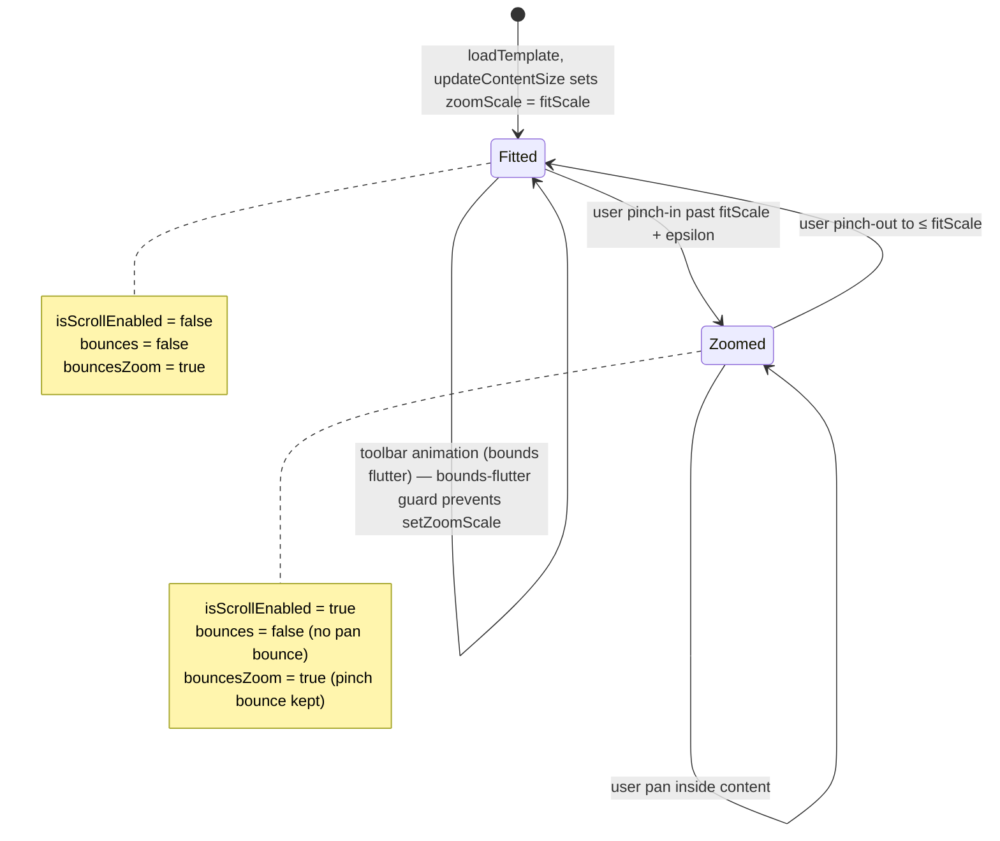

# Canvas UX — stop the bouncing, make fill work, verify brushes, add stay-in-the-lines, make the coloring loop feel premium

## Overview

The coloring canvas — the single most important surface in the app — does not feel good to use today. Three concrete bugs, one discoverability gap, one untested interaction surface, and one missing premium feature block a premium first impression:

1. **The canvas bounces / drifts around** during and after a tap or pinch, and when the toolbar animates. Root cause is the interaction between `PencilCanvasRepresentable`'s outer `UIScrollView`, `bouncesZoom=true`, and finger-pan being enabled while the default tool is a drawing tool.
2. **Tap-to-fill does not work** for a new user's first interaction. `BrushSettings.tool` defaults to `.pencil`, so the tap gesture recognizer in `PencilCanvasRepresentable` is deliberately disabled (`tapGesture.isEnabled = isNonDrawingTool`). On finger-only iPads, the default tool produces no visible result on tap (PencilKit refuses finger input via `drawingPolicy = .pencilOnly`), so the canvas appears dead. Onboarding says "Tap to Fill" but the default tool isn't Fill.
3. **The loop isn't confidence-inspiring.** There's no haptic / visual affordance when the user enters the canvas, no first-use coach for the Fill tool, no "welcome to this template" moment. The canvas just appears with a dormant toolbar.
4. **The four brushes (pencil, marker, watercolor, eraser) are untested under automation.** Because `drawingPolicy = .pencilOnly` blocks finger input, FlowDeck cannot drive the Pencil path via ordinary taps — so no regression test exists today for "does marker actually render a thick stroke," "does watercolor actually ship at 0.4 alpha," "does the eraser touch only PKDrawing strokes and not the fill image or line art." This plan adds a headless test harness that drives `PKCanvasView.drawing` programmatically (the only reliable way to exercise strokes in the Simulator, which has no real Pencil hardware model) plus a FlowDeck "feather-drawingPolicy" test mode for interactive smoke where appropriate.
5. **"Stay in the lines" is missing.** A defining premium-coloring-app feature (Pigment, Lake) is a mode that clips strokes to a single region so a user who wants a tidy look can get one without perfect motor control. This plan adds a toggle in a new canvas-settings sheet, with first-touched-region clipping semantics (the region under the first touch "captures" the stroke; movement outside that region is ignored for the rest of the stroke).

This plan lands the canvas as a **pleasurable, low-surprise coloring surface** that a reviewer or new user can pick up and use in under 30 seconds without guessing, with all four brushes proven to work and a premium "stay in the lines" affordance. Scope is intentionally narrow to the canvas surface: fix the bugs, close the first-use discoverability gap, prove brush correctness, add the stay-in-the-lines mode, add only the ambient polish that materially reduces friction. A separate plan can handle a broader visual refresh and app-icon design later.

This plan is characterization-test-first: for each reported or suspected bug and every newly added behavior we write a failing test (unit where testable, UI test driven by FlowDeck where not, headless PKDrawing injection where neither suffices) before touching the implementation, so the canvas stays fixed.

## Problem Frame

ColorFlow's positioning is "premium, distraction-free iPad coloring" competing with Lake ($39.99/yr) and Pigment ($59.99/yr). The roadmap plan (`docs/plans/2026-04-14-001-feat-app-store-readiness-roadmap-plan.md`) already covers submission hygiene, catalog growth, and the photo pipeline — but it does not cover the **felt quality of the canvas itself**.

A paid coloring app gets judged in the first 30 seconds of canvas interaction: does my finger do what I expect, does fill snap into place, does the layout feel intentional or janky. Today the answer is no for three avoidable reasons:

- **Default tool mismatch.** The app opens with `.pencil` selected, but the onboarding coach and the app's most distinctive feature (vector region fill) assume `.floodFill`. First taps on a finger-only iPad produce nothing.
- **Scroll-view jitter.** `PencilCanvasRepresentable` wraps four layers in a single `UIScrollView` so PencilKit strokes, fill image, line art, and background scale together. The implementation works in principle but has two specific jitter sources in practice: (a) `updateUIView` can trigger `updateContentSize` re-runs that re-seat the zoom scale, and (b) finger-pan stays enabled even when the content is fitted to the viewport, so stray finger contact drags the canvas around within its bounce zone.
- **Silent canvas.** There is no haptic, no brief hint, no color-chip pulse when the canvas first loads. A new user stares at a dark screen with a template and a left-rail toolbar and has to deduce the loop.

## Requirements Trace

- R1. On first open of any template, a tap with a finger on an enclosed region produces a visible fill in under ~300ms, without the user first changing tools. Either the default tool is `.floodFill` *or* there is an unmissable first-use affordance that switches to fill.
- R2. The canvas does not visibly jitter or "bounce" during or after: (a) a single tap, (b) toolbar collapse/expand animation, (c) a pinch-zoom gesture that ends inside `minimumZoomScale…maximumZoomScale`, (d) programmatic `updateUIView` triggered by unrelated state changes (tool selection, brush size, undo/redo).
- R3. When the document fits entirely within the viewport (zoomScale ≈ fitScale), finger-pan does nothing — the content stays centered and still. Pan is only permitted when the content is larger than the viewport (i.e. user has zoomed in).
- R4. Pinch-zoom uses natural bounce-back behavior *inside* the zoom range, but does not allow fling-past-bounds that leaves the content off-center after the bounce settles.
- R5. The first time a user enters the canvas in a session, a non-blocking, dismissible hint highlights the Fill tool and the color well. Hint is suppressed after one successful fill, forever (persisted).
- R6. Every canvas entry plays a subtle haptic `.light` (unless reduce-motion / reduced haptics is enabled). Every successful fill plays `.light` (already present — verify it still fires). Every tool selection plays `.light` (already present — verify).
- R7. Automated characterization tests reproduce each bug before the fix and pass after it, so the fixes survive future refactors. Tests live in `ColorFlowTests/Canvas/`.
- R8. Manual QA script exists in `docs/contributors/` enumerating the full canvas interaction matrix on a Pencil iPad and a non-Pencil iPad. Script is runnable via FlowDeck UI automation.
- R9. Every brush (`.pencil`, `.marker`, `.watercolor`, `.eraser`) has a proven-working characterization test that asserts: (a) a synthesized stroke of known geometry produces a visible difference in a rendered export image of the canvas at the stroke's path, (b) the stroke respects the active `BrushSettings.color`, `size`, and `opacity`, (c) the eraser removes strokes from `PKDrawing` only — the fill image and line art are untouched, (d) watercolor strokes ship at the expected ~0.4 alpha in the final raster output.
- R10. FlowDeck drives an interactive-simulator brush smoke test on the iPad Pro 13-inch simulator: open a template, programmatically inject a known `PKDrawing` for each brush, capture a screenshot, assert the stroke appears in the expected location. If `drawingPolicy = .pencilOnly` blocks direct finger-driven strokes (it does), the smoke test uses a debug-only app-launch arg (`-enableFingerDrawing`) to feather the policy to `.anyInput` for automation runs only. The flag must be no-op in Release builds.
- R11. "Stay in the lines" mode exists as a persisted, togglable canvas setting. When ON, a drawing stroke (pencil / marker / watercolor) is clipped to the region that contained the stroke's first touch point ("first-touched region wins"). When OFF (default), strokes render freely as they do today. Toggling the mode during an in-progress stroke applies to the next stroke, not the current one. The eraser ignores the mode entirely (erasing is always permitted everywhere).
- R12. Stay-in-the-lines mode is discoverable via a new "…" button in `ToolbarView` that presents a canvas-settings sheet. The sheet hosts the toggle with a short description and a state chip ("On" / "Off"). The sheet is also the future home for canvas-scoped settings that don't warrant their own toolbar button.
- R13. Stay-in-the-lines correctness: the clipping is visible in a rendered export. A stroke whose path crosses a region boundary is rendered with only the portion inside the first-touched region visible; the outside portion is not stored in the persisted `PKDrawing` (not just visually clipped), so re-opening the project does not reveal the clipped-off portion.
- R14. Stay-in-the-lines edge cases: stroke starting in a decorative area (no region under the first touch) is either rejected (no stroke committed) or committed unclipped — pick a policy, document it, test it. A stroke starting on a region boundary (ambiguous hit) resolves via `TemplateGeometry.region(at:)`'s existing deterministic ordering.

## Scope Boundaries

- **Out of scope: full visual redesign.** No typography system, no theme token refactor, no icon redesign, no redesigned Home/Library tabs. A separate plan covers those if the user greenlights. Premium UX here = the canvas works and feels intentional.
- **Out of scope: app-icon design.** Defer to a separate small plan. Explicitly noted because the user originally asked for it; splitting keeps this plan's review surface tight.
- **Out of scope: new brushes beyond the existing four.** The plan verifies pencil, marker, watercolor, eraser. Adding airbrush, ink, crayon, etc. is a separate plan.
- **Out of scope: rewriting the watercolor brush.** Today watercolor is approximated as `PKInkingTool(.monoline, alpha: 0.4)`. This plan verifies that approximation renders correctly and ships at 0.4 alpha. Replacing it with a real wet-on-wet simulation is a separate plan.
- **Out of scope: per-region or multi-region clipping in stay-in-the-lines.** First-touched-region-wins is the entire policy for v1 of that feature. Cross-region smart fills, palette-aware autoclip, and multi-region "all already filled" clipping are deferred follow-ups.
- **Out of scope: new canvas features beyond stay-in-the-lines.** No new tools, new export flows, new palette features, or new layer behaviors.
- **Out of scope: reworking the SVG parser / renderer.** The fill correctness work assumes the current `SVGParser` + `TemplateGeometry.region(at:)` + `TemplateRenderer.renderFillLayer` pipeline is functionally correct when it is actually invoked. If the characterization pass reveals a parser/renderer defect, that becomes a follow-up plan, not scope creep here.
- **Out of scope: rewriting the wrapper scroll view.** Keep the current single-UIScrollView architecture. Fix it in place. A rewrite is disproportionate to the problem.
- **Out of scope: the onboarding copy deck.** The OnboardingView already exists and shows the right message ("Tap to Fill"). This plan fixes the disconnect between what onboarding teaches and what the canvas defaults do; it does not redesign onboarding screens.
- **Out of scope: PencilKit behavior on Pencil iPads.** Already works. This plan is about finger-first correctness on non-Pencil iPads without regressing Pencil behavior. The brush tests drive the canvas via a feather-drawingPolicy debug flag on the Simulator specifically because the Simulator has no real Pencil hardware to drive — the tests are not a proxy for real-device Pencil QA.

## Context & Research

### Relevant code and patterns

- `ColorFlow/Views/Canvas/CanvasView.swift` — SwiftUI host. Constructs the ZStack with the wrapper representable and the floating toolbar. The `.onAppear` and `.task` lifecycle hooks are where a first-use hint would attach. The chrome layer (`HStack { if showToolbar … }`) animates with `.easeInOut(duration: 0.22)`; this animation is one jitter source during toolbar collapse.
- `ColorFlow/Views/Canvas/PencilCanvasRepresentable.swift` — where almost all canvas bugs live. Key seams:
  - Outer `UIScrollView` with `bouncesZoom = true` and finger panning enabled by default (no explicit `isScrollEnabled` gate tied to zoom state).
  - `updateUIView` re-runs on every `@Observable` viewmodel change and prints a mismatch check before calling `updateContentSize`.
  - `updateContentSize` calls `scrollView.setZoomScale(fitScale, animated: false)` only when `zoomScale >= 0.99`. That guard handles "don't clobber user zoom", but the first pass after bounds change can still overwrite zoom if bounds fluctuate while the toolbar animates.
  - `scrollViewDidZoom` re-centers `contentContainer.frame.origin` every zoom tick. This is correct conceptually but every toolbar animation frame triggers a bounds change which triggers a zoom delegate call which shifts the origin. That's the visual "bounce" during toolbar animations.
  - `handleTap` uses `gesture.location(in: content)` — correct coordinate space. Tap gesture is *only* enabled when `tool == .floodFill || .eyedropper`.
- `ColorFlow/Models/BrushSettings.swift` — `var tool: DrawingTool = .pencil` is the default. This is the root cause of fill-not-working-on-first-tap. Changing the default to `.floodFill` is the smallest possible fix but may regress Pencil iPad UX (Pencil users expect drawing by default). Resolution below.
- `ColorFlow/ViewModels/CanvasViewModel.swift`:
  - `performRegionFill(at:in:)` is the single fill entry point. Already logs extensively (print statements) and already triggers `HapticService.shared.impact(.light)` on success. Characterization tests should pin this down.
  - `canvasSize = geometry.viewBox.size` after load — this is the document space the scroll view sizes to. Tests can assert it's non-zero after `loadTemplate`.
- `ColorFlow/Services/TemplateRenderer.swift` — `documentToViewTransform` is the single transform used for both tap hit-testing (in the viewmodel) and rendering. Tests should round-trip a view-point → doc-point → region hit to confirm the inverse transform is correct.
- `ColorFlow/App/ColorFlowApp.swift` — `hasSeenOnboarding` gating via `@AppStorage`. First-use Fill hint should mirror this pattern (`@AppStorage("hasCompletedFirstFill")`).
- `ColorFlow/Models/BrushSettings.swift` — add persistence-aware default resolution instead of hardcoding.
- `ColorFlow/Services/HapticService.swift` — already exists (referenced by ToolbarView and viewmodel). Verify behavior when `UIAccessibility.isReduceMotionEnabled` is true.

### Institutional learnings

- `docs/solutions/2026-04-accessibility-baseline.md` — existing baseline notes on Dynamic Type + 44pt tap targets. The first-use hint and any new controls must clear both. The accessibility baseline also dictates VoiceOver labels; new UI needs `accessibilityLabel` and `accessibilityIdentifier`.
- No prior `docs/solutions/` entry on canvas jitter, scroll-view tuning, or first-use coaches. This plan produces one (`docs/solutions/2026-04-canvas-ux-jitter-fix.md`) as part of U6.

### External references

- Apple `UIScrollView` docs on `bouncesZoom`, `minimumZoomScale`, `maximumZoomScale`, `isScrollEnabled`. The `bouncesZoom = true` behavior is desirable for pinch feedback but interacts badly with programmatic `setZoomScale` during layout passes.
- Apple HIG "Gestures" — finger-first coloring apps should treat one-finger pan as "pan only when scrollable content exceeds the viewport." Mirror that behavior.
- Apple `PKCanvasView` docs — `drawingPolicy = .pencilOnly` is correct for a Pencil-targeted app but creates silent dead-taps on non-Pencil iPads unless the surrounding surface handles finger input meaningfully. Our surrounding surface is the scroll view + fill tap gesture, so this plan must make sure that path is alive.
- No new external dependency is introduced.

## Key Technical Decisions

- **Default tool becomes `.floodFill` after the user completes onboarding, not at app install.** Rationale: onboarding teaches "Tap to Fill." It is user-surprising for the very next screen to default to `.pencil`. Changing the static default in `BrushSettings` is brittle because PencilKit drawing is also a core feature. Instead, `CanvasViewModel` resolves the initial tool from `@AppStorage` on init: first canvas entry after onboarding → `.floodFill`; thereafter → the last tool the user picked. This preserves continuity for returning users while giving new users a canvas that matches what onboarding just promised.
- **Finger-pan is gated on zoom state.** Add a `scrollViewDidEndZooming` / `scrollViewDidZoom` update that sets `scrollView.isScrollEnabled = scrollView.zoomScale > fitScale + epsilon`. When the document fits, finger-pan is off and the canvas cannot drift under accidental touches. When the user pinches in, pan re-enables naturally.
- **`bouncesZoom` stays `true`, but `bounces` (pan bounce) is set to `false`.** Rationale: `bouncesZoom` gives satisfying pinch feedback; `bounces` during pan is the felt "bouncing" when the document is smaller than the viewport and a finger drags. Disabling `bounces` kills the unwanted pan bounce without losing the pinch feel.
- **`updateContentSize` is guarded against re-entry on bounds flutter.** Today the guard is `contentContainer?.frame.size != size`. Strengthen it with a second guard: only re-apply `setZoomScale` if the scroll view's bounds have not been touched in the last ~100ms (simple timestamp check). Toolbar animations produce a flurry of bounds updates; we don't want any of them to snap zoom back to fitScale mid-animation.
- **First-use Fill hint is a SwiftUI overlay on `CanvasView`, not a new screen.** `@AppStorage("hasCompletedFirstFill")` gates a `.overlay` that shows a subtle arrow pointing at the Fill tool button and a caption "Tap a region to fill." It auto-dismisses on the first successful `performRegionFill`, and has a ✕ button to dismiss manually. Zero new sheets, zero new navigation.
- **Characterization-first.** Every unit that claims to fix a bug ships with a failing test first. Jitter is hard to unit-test but we can assert scroll-view configuration invariants (e.g. "after `updateContentSize`, `isScrollEnabled == (zoomScale > fitScale)` holds"). Tap-to-fill is directly unit-testable via the viewmodel's `performRegionFill`. The end-to-end loop (first tap produces visible fill) uses a FlowDeck UI test.
- **No architectural change to the wrapper UIScrollView.** The current design is correct and documented. We tune it, not replace it.
- **The premium-polish deliverable is strictly: canvas entry haptic + tool-switch haptic + first-use hint + default-tool resolution.** No new visuals. A visual refresh is a separate plan if requested.
- **FlowDeck will own manual QA driving.** We've confirmed this session that FlowDeck UI automation's accessibility-tree path has known parse issues in the current simulator runtime combo — the plan tolerates that by preferring coordinate taps and log-based assertions when the AX tree is unreliable, and documenting the workaround in `docs/contributors/canvas-qa.md`.
- **PencilKit brush testing uses headless `PKDrawing` injection as the primary path, with a feather-policy debug flag as a secondary smoke path.** Rationale: FlowDeck's simulator input is finger-class (no `--touch-type pencil` flag), and `drawingPolicy = .pencilOnly` intentionally rejects finger input in Release. We cannot reliably synthesize real Pencil touch events from the host. Instead, tests construct `PKStroke` objects programmatically, insert them into `viewModel.drawing`, and assert both the in-memory invariants (stroke count, tool used, color / alpha / width metadata) and the rasterized output (via `TemplateRenderer.renderExport` piping the drawing + fill + line art and comparing specific pixel windows against expectations). A separate lighter FlowDeck smoke test launches the app with `-enableFingerDrawing` — a debug-only `#if DEBUG` launch argument that flips `drawingPolicy` to `.anyInput` — to exercise the full tap → PKCanvasView → stroke → render pipeline in a real simulator run. The flag is compiled out of Release builds so it cannot leak to production.
- **"Stay in the lines" clipping is enforced by intercepting strokes at commit time, not by masking the rendered output.** Rationale: masking the rendered output looks correct but leaves ghost stroke data in `PKDrawing` that would reappear if the mode is toggled off or if the project is exported via a code path that bypasses the mask. Intercepting at commit time means the canonical `PKDrawing` only contains the clipped path, so the behavior is invariant across re-open, export, undo, and mode toggle. Implementation: in `canvasViewDrawingDidChange`, if stay-in-the-lines is ON and the brush is a drawing tool, reconstruct each new `PKStroke` by clipping its `PKStrokePath` to the first-touched region's `CGPath`, and replace the canvas's `drawing` with the clipped version before propagating to the viewmodel. This reuses the existing `isRevertingDrawing` re-entry guard pattern.
- **First-touched-region wins for stay-in-the-lines.** The first sample of a new stroke is hit-tested against `TemplateGeometry.region(at:)` (same function fill already uses). Whichever region that sample falls inside "captures" the stroke for its duration. Subsequent samples outside that region are dropped from the stored stroke. This matches the user's chosen option and is the most predictable behavior (Pigment / Procreate adopt the same semantics).
- **Stay-in-the-lines is surfaced through a new canvas-settings sheet, not the toolbar directly.** Rationale: the toolbar is already dense (color well, six tools, brush size slider, undo/redo, layers). A `…` button opens a sheet that hosts stay-in-the-lines plus any future canvas-scoped toggles (e.g. "snap to palette," "show region outlines") without forcing them into the toolbar rail. The sheet reuses the existing `.presentationDetents([.medium])` pattern from `LayerPanelView`.

## Open Questions

### Resolved during planning

- *Why doesn't fill work on first tap?* — Default tool is `.pencil`; the tap gesture recognizer is only enabled when tool is `.floodFill`/`.eyedropper`. Resolved by post-onboarding default override.
- *What is "the bouncing"?* — Two distinct bugs conflated: (a) finger-pan drift when document fits viewport, (b) origin re-seating during toolbar animations when `scrollViewDidZoom` fires per bounds change. Both have targeted fixes above.
- *Should we ship an app-icon redesign in this plan?* — No. Split into a separate plan; this one stays about canvas correctness.
- *Should we ship a full theme refresh?* — No. Explicit non-goal. Revisit once the canvas feels right.
- *How do we verify visually given FlowDeck AX tree is fragile?* — Fall back to screenshot-only verification plus log-based assertions (`[Canvas] performRegionFill — hit region …`), and document the fallback.

### Deferred to implementation

- *Exact epsilon for the `zoomScale > fitScale + epsilon` gate.* Depends on floating-point behavior after `setZoomScale`. Pick during U3 after observing a run.
- *Exact debounce window for the bounds-flutter guard.* 100ms is a guess; measure once toolbar-animation logs are in hand.
- *Whether to show the first-use hint as a tooltip bubble or a highlighted pulsing ring around the Fill tool.* A/B the two during U5; the plan allows either.
- *Whether tool-switch haptics should honor `UIAccessibility.isReduceMotionEnabled` or get a dedicated "reduce haptics" setting.* Probably the former for v1; confirm during U5.
- *Whether `BrushSettings.tool` persistence should live in `UserDefaults`, `@AppStorage`, or the per-project `ProjectPaintState`.* Lean toward `@AppStorage` (last-used tool is a user preference, not a project attribute), but confirm by grepping for existing patterns.
- *Pixel-comparison tolerance for brush render tests.* PencilKit stroke rendering has anti-aliasing that can vary 1-2 grayscale steps between runs. Use a small tolerance window (e.g. mean absolute pixel delta < 4 over a 16×16 window centered on the expected stroke). Tune in U7.
- *Policy for stay-in-the-lines strokes that start outside any region* (decorative whitespace). Two viable policies: (a) reject the stroke entirely, or (b) commit unclipped. (b) is more permissive and matches "the user chose to draw outside a region, honor that." (a) is more pedagogical. Pick (b) for v1 unless QA surfaces a good reason otherwise; test either way.
- *Performance budget for stroke clipping.* `PKStrokePath.interpolatedPoints(by:)` samples can be hundreds per stroke; clipping each to a `CGPath.contains` check is O(n × region-path-complexity). On simple templates this is trivially fast, but on a 500-point stroke against a 2000-segment region path it could stall the main thread. Measure during U8 with a worst-case template; if it stalls, move the clip off-main-thread and commit the clipped stroke asynchronously (may require a "stroke in flight" visual hint).
- *Whether to visually indicate when a stroke is being clipped.* Option: a subtle glow on the first-touched region while the stroke is in progress. Skip for v1 (simpler); reconsider if users report "why isn't my line drawing."

## High-Level Technical Design

> *This illustrates the intended approach and is directional guidance for review, not implementation specification. The implementing agent should treat it as context, not code to reproduce.*

### Before / after interaction shape

```
CURRENT (buggy):
  User opens template
  → tool = .pencil (hardcoded default)
  → tap gesture recognizer disabled
  → finger tap on canvas: nothing happens (PencilKit refuses finger; no fill)
  → user confused
  → user happens to drag finger
  → content bounces around within scroll view bounce zone
  → user double-confused

DESIRED:
  User opens template (after onboarding)
  → tool = .floodFill (resolved from AppStorage on first post-onboarding entry)
  → tap gesture recognizer enabled
  → first-use hint overlay: "Tap a region to fill"
  → finger tap on enclosed region: region fills in < 300ms, haptic .light, hint dismisses
  → user tries to drag: content is fitted, finger-pan is disabled, nothing drifts
  → user pinches in: content scales, finger-pan re-enables naturally, bouncesZoom gives pinch feel
  → user releases: no pan bounce, no origin re-seating
```

### Scroll-view state machine



### Tool-resolution decision

```
BrushSettings.tool initial value resolution (on CanvasViewModel init):

  if @AppStorage("lastUsedTool") exists:
    tool = that
  else if @AppStorage("hasSeenOnboarding") == true:
    tool = .floodFill         ← the canvas-entry delta
  else:
    tool = .pencil            ← (pre-onboarding path, unlikely in practice)

  On every tool change in ToolbarView:
    @AppStorage("lastUsedTool") = newTool
```

### Brush-test harness (headless PKDrawing injection)

```
For each brush in [.pencil, .marker, .watercolor, .eraser]:
  1. Build a CanvasViewModel against a fixture Project + Template.
  2. Await loadTemplate.
  3. Set viewModel.brushSettings.tool = brush, color = .systemRed, size = 8, opacity = 1.0.
  4. Construct PKStrokePoint list along a known straight line (doc-space).
  5. Build PKStrokePath → PKStroke using viewModel.currentPKTool as the ink.
  6. Set viewModel.drawing = PKDrawing(strokes: [stroke]).
  7. Call TemplateRenderer.renderExport to get a UIImage.
  8. Sample a small window of pixels centered on the midpoint of the stroke.
  9. Assertions per brush:
       .pencil      → non-white pixel, red-dominant channel, within alpha tolerance of opaque.
       .marker      → thicker band of red than pencil (count red pixels in a cross-section).
       .watercolor  → red pixels but averaged alpha ≈ 0.4 (i.e. pre-multiplied red intensity materially lower than marker at the same size).
       .eraser      → after first writing a pencil stroke THEN an overlapping eraser stroke, the sample window is white/background (stroke cleared from PKDrawing).

For the eraser-boundary test:
  - Write a pencil stroke across a filled region.
  - Apply an eraser stroke over the same area.
  - Render export.
  - Assert: the FILLED REGION pixel color is unchanged (still the fill hex) — the eraser only removed the PKDrawing stroke, not the fill layer, not the line art.
```

### Stay-in-the-lines clip pipeline

```
User starts stroke at point P (doc space).
  |
  ├── If stayInTheLines == OFF:
  │     standard PencilKit path → stroke rendered freely (today's behavior).
  │
  └── If stayInTheLines == ON:
        firstTouchRegion = templateGeometry.region(at: P)
        if firstTouchRegion == nil:
          policy "commit unclipped" → standard path (deferred decision, see Open Questions).
        else:
          on stroke end (canvasViewDrawingDidChange with new stroke):
            take newStroke = last stroke in canvas.drawing
            clippedStroke = clipStrokeToRegion(newStroke, region: firstTouchRegion)
              - iterate PKStrokePoint samples
              - drop points where samplePoint.location (doc space) is outside region.path
              - re-emit PKStrokePath from surviving subsequences (may be multiple sub-strokes if the user re-entered the region)
            replace canvas.drawing = drawing with newStroke swapped for clippedStroke
            propagate to viewModel.drawing (guarded by isRevertingDrawing re-entry flag)
            scheduleAutoSave()
```

Visual semantics:
- The mode captures the first-touched region at stroke START; the user can drift outside and the parts outside are silently dropped. The user sees their stroke paint only inside the region, which is the "stay in the lines" feel.
- Toggling the mode mid-stroke has no effect on the current stroke (captured at start). The next stroke honors the new state.
- Eraser ignores the mode. Users can always clean up anywhere.

## Implementation Units

Eight units. Order is strict: U1 (tests) → U2 (default tool) → U3 (finger-pan gate) → U4 (bounds-flutter guard) → U5 (first-use hint + haptic polish) → U7 (brush verification harness) → U8 (stay-in-the-lines). U6 (QA script + solutions writeup) runs last, after all implementation is green. U7 and U8 can technically run in parallel after U2-U5 land — they touch different seams (U7 = test harness + debug launch arg; U8 = commit-time stroke clip + new settings sheet) — but sequential execution is simpler if one agent is running them.

Every behavioral unit begins with a failing characterization test. Tests live in `ColorFlowTests/Canvas/` (new directory — create it in U1).

### Unit U1: Canvas characterization-test harness

**Goal:** Stand up `ColorFlowTests/Canvas/` with failing tests that reproduce each reported bug, plus a `FlowDeckCanvasSmokeTests` stub that drives the real simulator via FlowDeck. No production code changes yet.

**Requirements:** R7, R8, R9 (red-bar harness for brushes), R11 (red-bar harness for stay-in-the-lines)

**Dependencies:** None

**Files:**
- Create: `ColorFlowTests/Canvas/CanvasViewModelFillTests.swift`
- Create: `ColorFlowTests/Canvas/CanvasScrollViewConfigurationTests.swift`
- Create: `ColorFlowTests/Canvas/CanvasDefaultToolTests.swift`
- Create: `ColorFlowTests/Canvas/CanvasBrushRenderTests.swift` (empty failing stubs for pencil/marker/watercolor/eraser — filled in U7)
- Create: `ColorFlowTests/Canvas/CanvasStayInTheLinesTests.swift` (empty failing stubs for the clip pipeline — filled in U8)
- Create: `ColorFlowTests/Canvas/FlowDeckCanvasSmokeTests.swift` (XCUITest-style, driven via FlowDeck from CI/local)
- Create: `ColorFlowTests/Canvas/Support/PKStrokeFactory.swift` (test helper to build deterministic `PKStroke` objects along a straight line — shared by U7 and U8)
- Modify: `project.yml` — add `ColorFlowTests/Canvas/**` to the test target's source group, re-run xcodegen after

**Approach:**
- Load a known-good SVG (`ColorFlow/Resources/Templates/sunflower_mandala.svg` or similar — pick one that parses with >3 regions) in a test-only helper.
- Construct a `CanvasViewModel` against a fixture `Project` + `Template`, run `await viewModel.loadTemplate()`, assert `canvasSize != .zero` and `templateGeometry?.regions.count > 0`.
- For fill: pick a known doc-space point inside a known region (compute from `geometry.regions[0].path.boundingBox` centroid), call `await viewModel.performRegionFill(at:in:)`, assert `paintState.regionFills[regionID] != nil`. This test should pass today — it pins current behavior.
- For default tool: assert `CanvasViewModel(project:, template:).brushSettings.tool == .floodFill` when `hasSeenOnboarding = true` and no `lastUsedTool` is set. **This test fails today** (default is `.pencil`).
- For scroll-view configuration: this is harder to unit-test in isolation. Instead write an assertion-style test that instantiates `PencilCanvasRepresentable` and its Coordinator in a test harness (`UIHostingController` in a test window), drives `updateContentSize`, and asserts post-conditions: `scrollView.bounces == false`, `scrollView.bouncesZoom == true`, `scrollView.isScrollEnabled == (zoomScale > fitScale + epsilon)`. **These tests fail today.**
- FlowDeck smoke test: a shell script `Scripts/qa/canvas_smoke.sh` that uses FlowDeck to launch, advance past onboarding, open a template, tap inside the template area, and verify via log scraping that `[ViewModel] performRegionFill — hit region` appears. This is the end-to-end "first tap fills a region" gate.

**Execution note:** Test-first — write these tests RED before any code changes in U2-U5. Do not alter production code in this unit.

**Patterns to follow:**
- `ColorFlowTests/PhotoPreValidatorTests.swift` for pure-Swift unit test structure.
- `ColorFlowTests/UserTemplatePersistenceTests.swift` for fixtures + temporary directories.
- `run_tests.sh` for the existing test runner invocation.

**Test scenarios:**
- Happy path: `loadTemplate` completes, `canvasSize != .zero`, `regions.count > 0`, centroid of first region hit-tests to that region.
- Happy path: `performRegionFill` at a known hit point sets `paintState.regionFills[regionID]` to the current brush color hex.
- Edge case: `performRegionFill` at a point outside all regions leaves `paintState` unchanged and does not throw.
- Edge case (failing today): `CanvasViewModel.brushSettings.tool == .floodFill` after onboarding with no prior tool preference.
- Edge case (failing today): Scroll-view `bounces == false`, `isScrollEnabled == false` when `zoomScale <= fitScale + epsilon`.
- Integration (FlowDeck): launching the app fresh, clearing `hasSeenOnboarding` and `hasCompletedFirstFill`, advancing past onboarding, tapping the center of the canvas produces a `performRegionFill — hit region` log entry within 2 seconds.
- Red-bar (U7): `CanvasBrushRenderTests` contains a failing stub for each of the four brushes (pencil, marker, watercolor, eraser) that calls the yet-to-exist render-and-sample helper and expects to find red pixels in the stroke window. Fails on "helper not implemented."
- Red-bar (U8): `CanvasStayInTheLinesTests` contains failing stubs for (a) stroke fully inside region stays unchanged, (b) stroke crossing boundary is clipped, (c) stroke starting outside any region honors the chosen policy, (d) toggling mid-stroke does not affect in-progress stroke, (e) eraser ignores the mode. Fails on "stayInTheLines property does not exist" / "clipStrokeToRegion helper not implemented."

**Verification:**
- Fill + parser tests pass (pinning current good behavior).
- Default-tool + scroll-view config tests fail with descriptive messages naming the invariant they check.
- FlowDeck smoke test fails on "no `performRegionFill` log within timeout."
- Brush + stay-in-the-lines tests fail with clear compile-time or assertion messages pointing at the missing APIs to implement in U7 and U8.
- `bash run_tests.sh` surfaces all test results clearly without false positives.

---

### Unit U2: Post-onboarding default tool resolution

**Goal:** When a user opens any canvas after completing onboarding, and has not yet explicitly picked a tool, the initial tool is `.floodFill`. Returning users keep their last explicitly picked tool.

**Requirements:** R1

**Dependencies:** U1 (tests exist)

**Files:**
- Modify: `ColorFlow/ViewModels/CanvasViewModel.swift` — resolve initial `brushSettings.tool` from `@AppStorage` at init time.
- Modify: `ColorFlow/Models/BrushSettings.swift` — keep `.pencil` as the *struct* default; resolution is a viewmodel concern, not a model concern.
- Modify: `ColorFlow/Views/Tools/ToolbarView.swift` — when the user selects a new tool, write it back to `@AppStorage("lastUsedTool")`.
- Test: `ColorFlowTests/Canvas/CanvasDefaultToolTests.swift` (already failing from U1)

**Approach:**
- Read `@AppStorage("lastUsedTool")` (string raw value) inside `CanvasViewModel.init`. If present and decodes to a valid `DrawingTool`, use it. If absent, check `@AppStorage("hasSeenOnboarding")` — true ⇒ `.floodFill`; false ⇒ `.pencil`.
- `ToolbarView`'s existing `ToolButton` action block already calls `viewModel.brushSettings.tool = tool`. Add a side effect alongside it that persists the raw value. Keep the persistence read/write out of `BrushSettings` itself to avoid making the struct non-Codable.

**Patterns to follow:**
- `@AppStorage("hasSeenOnboarding")` in `ColorFlow/App/ColorFlowApp.swift` — same pattern, same location style.
- `ColorFlow/ViewModels/CanvasViewModel.swift` `loadRecentColors()` for "read UserDefaults on init" structure.

**Test scenarios:**
- Happy path: fresh install, post-onboarding, new template → `brushSettings.tool == .floodFill`.
- Happy path: user picks `.marker` on one template, closes, opens another → `brushSettings.tool == .marker`.
- Edge case: `hasSeenOnboarding == false` (should be unreachable in practice but guard against it) → `.pencil`.
- Edge case: corrupted `lastUsedTool` value in `UserDefaults` (e.g. unknown raw string) → fall through to post-onboarding default, do not crash.
- Integration: tool switch in `ToolbarView` persists; next `CanvasViewModel` instance reads the same value.

**Verification:**
- Default-tool tests from U1 pass.
- No regression in existing viewmodel tests.
- Manual: launch, advance past onboarding, open a template, confirm Fill tool is the selected one in the toolbar.

---

### Unit U3: Finger-pan gated on zoom state

**Goal:** When the document fits the viewport, finger-pan is disabled. When the user pinches in past `fitScale + epsilon`, finger-pan re-enables. Kill pan-bounce entirely (`bounces = false`). Keep `bouncesZoom = true` for pinch feel.

**Requirements:** R2, R3, R4

**Dependencies:** U1 (tests exist), U2 (default tool landed — so manual QA has a working fill to pair with the pan behavior)

**Files:**
- Modify: `ColorFlow/Views/Canvas/PencilCanvasRepresentable.swift`
  - In `makeUIView`: set `scrollView.bounces = false`.
  - In `Coordinator.updateContentSize`: after computing `fitScale`, set `scrollView.isScrollEnabled = scrollView.zoomScale > fitScale + epsilon`.
  - In `Coordinator.scrollViewDidEndZooming`: re-evaluate the same `isScrollEnabled` predicate.
  - Add a stored `private let epsilon: CGFloat = 0.001` or similar on the Coordinator; tune during QA.
- Test: `ColorFlowTests/Canvas/CanvasScrollViewConfigurationTests.swift` (already failing from U1)

**Approach:**
- Do not disable the outer scroll view's user interaction wholesale — that would also disable pinch. `isScrollEnabled` on a `UIScrollView` affects pan specifically; pinch is controlled independently by `pinchGestureRecognizer.isEnabled` (leave it on).
- The tap gesture recognizer is attached to the scroll view; it must keep firing when `isScrollEnabled = false`. Verify with a test + manual — `UITapGestureRecognizer` is not affected by `isScrollEnabled`.
- The `scrollViewDidZoom` origin-recentering logic already handles the fitted case; it remains correct and does not need to change.

**Patterns to follow:**
- The existing coordinator structure in `PencilCanvasRepresentable.swift` — stored references, delegate methods, no SwiftUI inside Coordinator.
- Apple's `UIScrollView` pinch+pan decoupling convention.

**Test scenarios:**
- Happy path: after `updateContentSize`, with `zoomScale == fitScale`, `scrollView.isScrollEnabled == false`.
- Happy path: simulate `scrollView.zoomScale = fitScale * 2`, call `scrollViewDidEndZooming`, assert `isScrollEnabled == true`.
- Edge case: `fitScale == zoomScale` exactly (within epsilon) → `isScrollEnabled == false` (no false positives from floating-point noise).
- Edge case: document larger than viewport on load (very wide viewBox) → initial `fitScale < 1` but pan may still be legitimately needed; assert behavior matches the predicate.
- Integration (manual / FlowDeck smoke): tap-drag with a finger on a fitted canvas produces no visible movement in the screenshot diff; tap-drag after pinch-in does pan the content.

**Verification:**
- Scroll-view config tests from U1 pass.
- Manual: on the iPad Pro 13-inch simulator, opening a template and dragging with a finger does not cause the canvas to drift at all.
- Manual: pinch-in, then drag — content pans normally. Pinch-out back to fit — pan disables again.
- No regression in Pencil drawing (test on a simulator with Pencil simulation, or log that this is a device-only verification deferred to U6 QA).

---

### Unit U4: Bounds-flutter guard on `updateContentSize`

**Goal:** Toolbar collapse/expand animations and other scroll-view bounds flutter no longer cause the canvas to re-seat its zoom or origin mid-animation. Programmatic `updateUIView` triggered by unrelated view-model changes does not trigger zoom snap.

**Requirements:** R2

**Dependencies:** U1 (tests exist), U3 (finger-pan gated — reduces confounds in manual QA)

**Files:**
- Modify: `ColorFlow/Views/Canvas/PencilCanvasRepresentable.swift`
  - In `Coordinator`: add `private var lastZoomApplyTime: Date?` and `private let zoomApplyDebounce: TimeInterval = 0.1`.
  - In `updateContentSize`: gate the `setZoomScale(fitScale, animated: false)` branch on `lastZoomApplyTime == nil || Date().timeIntervalSince(lastZoomApplyTime!) > zoomApplyDebounce`. Record `lastZoomApplyTime = Date()` after applying.
  - Strengthen the `contentContainer?.frame.size != size` guard in `updateUIView` to a point-level equality check (avoid float noise triggering a re-run on `isEqual` failure at the last bit).
  - Remove or gate the `print("[Canvas] contentSize mismatch …")` log behind `#if DEBUG` — it's noise in Release (already required by the A3 release-logging solution).
- Test: `ColorFlowTests/Canvas/CanvasScrollViewConfigurationTests.swift` — add a jitter test.

**Approach:**
- The guard is not about "never re-snap zoom" — it's about "don't snap zoom twice within one animation frame cluster." 100ms is one order of magnitude below the toolbar animation duration (220ms) and above one display refresh (~16ms), which is the right window.
- Verify `scrollViewDidZoom`'s content re-centering still runs every frame (it must, for smooth pinch) — the debounce is *only* on the programmatic `setZoomScale` branch.
- Consider also: if `scrollView.bounds.size` equals the previous call's bounds (stored), skip `updateContentSize` entirely — the fluttering is just bounds oscillating back to the same pair of values, and a no-op update avoids the side-effect chain.

**Patterns to follow:**
- `canvasViewDrawingDidChange`'s `isRevertingDrawing` re-entry flag — same pattern of "coordinator-stored gate to prevent self-interference."
- `docs/solutions/2026-04-release-logging.md` for the debug-gating convention.

**Test scenarios:**
- Happy path: two calls to `updateContentSize` within 10ms only apply `setZoomScale` once (second call short-circuits).
- Happy path: one call, wait 200ms, call again with a new size → both calls apply `setZoomScale` (debounce expired and size differs).
- Edge case: `updateContentSize` called with identical bounds and identical size as previous call is a no-op (no side effects, no prints in Release).
- Integration (FlowDeck): collapse the toolbar, capture screenshots at 50ms intervals for 500ms, assert no frame shows content at a different origin than the previous frame except during the explicit animation window.

**Verification:**
- Jitter test passes.
- Manual: tap the sidebar-toggle button, canvas stays visually still during the 220ms animation (the toolbar moves, the canvas does not).
- No regression in pinch-zoom smoothness.

---

### Unit U5: First-use Fill hint + canvas-entry haptic + tool-switch haptic audit

**Goal:** New users get one non-blocking coach that makes the loop obvious on the first template they open. Haptic parity is verified and documented.

**Requirements:** R5, R6

**Dependencies:** U1, U2 (default tool is fill — so the hint has something to point at that is actually active)

**Files:**
- Modify: `ColorFlow/Views/Canvas/CanvasView.swift` — add an `.overlay` gated on `@AppStorage("hasCompletedFirstFill") == false`. Overlay is an `HStack` with a subtle downward-arrow `Image` pointing at the Fill tool, plus a caption "Tap a region to fill," plus a close ✕ button. Dismisses on either close tap or on the first `performRegionFill` success.
- Modify: `ColorFlow/ViewModels/CanvasViewModel.swift` — in `performRegionFill`, after a successful hit, set `@AppStorage("hasCompletedFirstFill") = true` once. Use an injected `UserDefaults` for testability.
- Modify: `ColorFlow/Views/Canvas/CanvasView.swift` `.onAppear` — fire `HapticService.shared.impact(.light)` once per canvas entry.
- Modify: `ColorFlow/Services/HapticService.swift` (if not already) — respect `UIAccessibility.isReduceMotionEnabled` by short-circuiting.
- Test: `ColorFlowTests/Canvas/CanvasFirstFillHintTests.swift` (new file).

**Approach:**
- Overlay is pure SwiftUI, uses existing typography / dark theme, and is dismissible. No animation beyond a simple `.transition(.opacity)`.
- Overlay positions itself near the Fill tool button using `.alignmentGuide` or a fixed leading offset computed from the toolbar width. If that gets brittle, fall back to a pulsing ring drawn on top of the Fill button's frame (captured via `GeometryReader` within the toolbar). Decide during implementation; either satisfies the requirement.
- Accessibility: label the hint container with a combined `accessibilityLabel("First-use hint: Tap a region to fill. Double-tap to dismiss.")` and identifier `canvas.firstfill.hint`.
- Audit tool-switch haptic: `ToolbarView` already fires `HapticService.shared.impact(.light)` on tool change. Confirm canvas-entry haptic does not double-fire when the view re-renders (guard with a `@State var didFireEntryHaptic = false`).

**Patterns to follow:**
- `@AppStorage("hasSeenOnboarding")` gating in `ColorFlowApp.swift`.
- `CanvasView`'s existing `.sheet` modifiers for overlay layering.
- `HapticService.shared.impact(.light)` call sites — keep the call site API stable.

**Test scenarios:**
- Happy path: `hasCompletedFirstFill == false` + canvas entry → hint visible.
- Happy path: one successful `performRegionFill` → `hasCompletedFirstFill == true`, hint dismissed.
- Happy path: on a subsequent canvas entry after a successful fill, hint does not reappear.
- Edge case: `performRegionFill` at a miss (no region hit) does not flip `hasCompletedFirstFill` — hint stays.
- Edge case: user taps ✕ on the hint without ever filling → hint dismisses for the session; reappears on next canvas entry (we only persist after actual success). Confirm this matches the requirement; if product prefers "once dismissed, never again," flip to persist on close.
- Accessibility: VoiceOver reads the hint container label; swipe-dismiss gesture works.
- Edge case: `UIAccessibility.isReduceMotionEnabled == true` → canvas-entry haptic is suppressed; fill-success haptic may still fire (follow platform convention — document what we do).

**Verification:**
- First-fill-hint tests pass.
- Manual: reset simulator user defaults, advance through onboarding, open a template, see the hint, tap a region, see the fill land and the hint dismiss.
- Manual: re-enter a canvas after one fill, hint does not appear.
- Manual: toggle Reduce Motion in simulator Settings, re-enter canvas, no entry haptic fires.

---

### Unit U7: Brush verification harness + FlowDeck finger-drawing smoke

**Goal:** Every brush (pencil, marker, watercolor, eraser) has an automated test that asserts its stroke renders correctly with the expected geometry, color, size, and opacity. A FlowDeck smoke test exercises the real `PKCanvasView` stroke path in a Simulator using a debug-only launch argument.

**Requirements:** R9, R10

**Dependencies:** U1 (failing stubs in `CanvasBrushRenderTests` exist), U2-U5 green (so the canvas entry path is stable — brush tests build on top of a working canvas).

**Files:**
- Modify: `ColorFlow/Views/Canvas/PencilCanvasRepresentable.swift` — in `makeUIView`, read a debug-only launch argument `-enableFingerDrawing` and, only in `#if DEBUG`, flip `canvas.drawingPolicy = .anyInput`. In Release builds the branch is compiled out and the code behaves identically to today.
- Modify: `ColorFlow/Services/TemplateRenderer.swift` — expose a test-helper entry point (or a new internal-scoped function) that renders export with the current viewmodel's drawing + fills. Guarded behind `@testable import` so no public API is added.
- Create: `ColorFlowTests/Canvas/CanvasBrushRenderTests.swift` (implement the stubs from U1). Fill in render + pixel-sample helpers.
- Create: `ColorFlowTests/Canvas/Support/PixelSampler.swift` — test helper: given a `UIImage` and a rect, return average RGBA of the pixels in that rect.
- Create: `Scripts/qa/brush_smoke.sh` — FlowDeck smoke script that launches the app with `--args -enableFingerDrawing`, advances past onboarding, opens a template, selects each brush in turn, draws a short finger swipe, captures a screenshot after each, and asserts visible change via image-delta comparison.
- Modify: `docs/contributors/canvas-qa.md` (created in U6) — append a section on the Pencil/brush test limitations and the finger-drawing debug flag; cross-reference.

**Approach:**
- The fundamental constraint: in the iOS Simulator there is no Pencil hardware to simulate. FlowDeck injects finger touches. `drawingPolicy = .pencilOnly` rejects them. We solve this two ways:
  1. **Primary:** headless `PKDrawing` injection. Construct `PKStrokePoint` arrays in doc space, build a `PKStrokePath`, build a `PKStroke` using `viewModel.currentPKTool` as the ink, insert into `viewModel.drawing`. Render the canvas via `TemplateRenderer.renderExport` and sample pixels. This is deterministic, reproducible, and exercises the `PKTool` → stroke → raster pipeline end-to-end without needing finger/Pencil input at all.
  2. **Secondary:** debug-only `-enableFingerDrawing` launch arg. When set AND `#if DEBUG`, flip `drawingPolicy` to `.anyInput` so FlowDeck's finger touches reach PencilKit. This exists because headless tests cannot validate the full gesture pipeline (gesture recognizer delivery, palm rejection, drawing surface hit-testing); they only validate the stroke-to-raster path. The FlowDeck smoke test in `Scripts/qa/brush_smoke.sh` runs this path end-to-end.
- The `-enableFingerDrawing` flag must be verifiably no-op in Release. Unit test: build in Release config (or simulate via `#if !DEBUG` preprocessing) and assert the flag is ignored.
- Pixel-delta tolerance: use mean absolute RGBA delta < 4 over a 16×16 window centered on the expected midpoint. This tolerates PencilKit's anti-aliasing without letting a fully-blank stroke pass.
- Watercolor-specific assertion: at 0.4 alpha, a pencil stroke over a white background should produce a mid-red (roughly RGB ≈ `(red * 0.4 + white * 0.6)`) — assert average red channel < 200 and > 100 (fully-opaque red would be ~255, zero red would be 0, watercolor should land mid-range).
- Eraser-specific assertion: the test paints a pencil stroke FIRST into `viewModel.drawing`, then appends an eraser stroke overlapping it, then re-renders. The window under the overlap should be white (stroke removed) AND a separate assertion pins the fill-layer image to be pixel-equal before and after (eraser did not touch the fill layer).

**Patterns to follow:**
- `ColorFlow/Services/TemplateRenderer.swift`'s `renderExport` signature — reuse as-is for test render paths.
- `ColorFlow/Models/BrushSettings.swift` `pkTool(color:width:)` — the single source of truth for brush → `PKTool` mapping. Tests call this same method, so when someone changes a brush's ink mapping, the tests reflect that.
- `ColorFlowTests/PhotoPreValidatorTests.swift` for test fixture structure.
- Existing `run_tests.sh` test invocation.

**Execution note:** Test-first. The stubs exist in U1; this unit fills them in such that they pass only once the debug flag and render helpers are in place.

**Test scenarios:**
- Happy path — pencil: stroke along `(100,100) → (300,100)` with red, size 8, opacity 1.0 → rendered export has red-dominant pixels along the path. Sample window at midpoint has mean R > 200, G < 80, B < 80.
- Happy path — marker: same geometry, `PKInkingTool(.marker)` → stroke is visibly thicker than pencil (assert red-pixel count across a cross-section perpendicular to the stroke is > 1.5× pencil's count at the same nominal size).
- Happy path — watercolor: same geometry with opacity implicit in the tool mapping (0.4 alpha on monoline) → sample window mean R in [100, 200], alpha-blend signature distinguishes it from marker.
- Happy path — eraser: pre-fill `viewModel.drawing` with a pencil stroke, append eraser along the same path → sample window at midpoint is white (R, G, B all > 245), AND `fillLayerImage` is pixel-equal before/after the eraser pass.
- Edge case — color change: change brush color to blue, draw another stroke → sample window has blue-dominant pixels. Pins that `BrushSettings.color` actually flows to `currentPKTool`.
- Edge case — size change: draw two pencil strokes of size 4 and size 20 → cross-section red-pixel counts differ by > 3× (pins `BrushSettings.size` flowing to the ink width).
- Edge case — opacity slider (future): not in this plan's scope; mark as future coverage once an opacity slider lands.
- Release build no-op: `-enableFingerDrawing` set + Release config → `canvas.drawingPolicy` is still `.pencilOnly`. Tested via conditional compile; also a spec in the smoke script confirms via `flowdeck logs` that the feather branch did not execute.
- Integration (FlowDeck `brush_smoke.sh`): launch with `-enableFingerDrawing`, advance past onboarding, open a template, select pencil, swipe across the canvas, capture screenshot, assert visible pixel change vs pre-swipe screenshot. Repeat for marker, watercolor, eraser.

**Verification:**
- All four brushes have passing render tests.
- Eraser test confirms fill-layer independence.
- Release no-op test passes.
- `brush_smoke.sh` on a clean simulator produces four distinguishable stroke screenshots (one per brush) in under 90 seconds, and prints a summary of pixel-delta magnitude per brush.
- `bash run_tests.sh` shows the brush tests green after this unit.

---

### Unit U8: Stay-in-the-lines mode — commit-time stroke clipping + canvas-settings sheet

**Goal:** A persisted, toggleable canvas setting that clips drawing-brush strokes to the first-touched region. Mode is discoverable via a new `…` button in the toolbar that opens a canvas-settings sheet.

**Requirements:** R11, R12, R13, R14

**Dependencies:** U1 (failing stubs exist in `CanvasStayInTheLinesTests`), U2 (default tool resolution — so the mode has a sensible starting state), U7 not strictly required but recommended (brush tests provide render-verification scaffolding reused here).

**Files:**
- Modify: `ColorFlow/ViewModels/CanvasViewModel.swift`:
  - Add `var stayInTheLines: Bool = false` (persisted via `@AppStorage("stayInTheLines")` read/write on init and on set).
  - Add `private var currentStrokeCaptureRegion: RegionGeometry?` to track the first-touched region for the in-progress stroke.
  - Add `func clipStroke(_ stroke: PKStroke, toRegion region: RegionGeometry) -> PKStroke?` — returns a new stroke with points outside the region dropped; nil if no points survive.
- Modify: `ColorFlow/Views/Canvas/PencilCanvasRepresentable.swift`:
  - In `canvasViewDrawingDidChange`: when the brush is a drawing tool AND `viewModel.stayInTheLines == true` AND a new stroke was appended, look up the first sample's doc-space position, resolve the region via `templateGeometry.region(at:)`, clip the stroke via the new helper, and replace the drawing before propagating (guarded by `isRevertingDrawing`).
  - No change to eraser or non-drawing-tool paths.
- Create: `ColorFlow/Views/Tools/CanvasSettingsSheet.swift` — SwiftUI sheet hosting the stay-in-the-lines toggle + short explainer text. Designed to host future toggles.
- Modify: `ColorFlow/Views/Tools/ToolbarView.swift`:
  - Add a `…` button below the Layers button (before the bottom padding), opening the new sheet via `@Binding var showCanvasSettings: Bool` passed down from `CanvasView`.
- Modify: `ColorFlow/Views/Canvas/CanvasView.swift`:
  - Add `@State private var showCanvasSettings = false`.
  - Pipe the binding into `ToolbarView`.
  - Add a `.sheet(isPresented: $showCanvasSettings) { CanvasSettingsSheet(viewModel: viewModel) }` modifier with `.presentationDetents([.medium])`.
- Modify: `ColorFlowTests/Canvas/CanvasStayInTheLinesTests.swift` — implement the failing stubs from U1.

**Approach:**
- **Clipping happens at commit time, not render time.** `canvasViewDrawingDidChange` is the commit seam: PencilKit has already committed the stroke to its internal `PKDrawing`, the delegate fires with the new drawing. We intercept, clip, replace the drawing, and only then propagate to `viewModel.drawing`. Replacing `canvas.drawing` triggers another `canvasViewDrawingDidChange`, which we short-circuit via the existing `isRevertingDrawing` flag (pattern already present for the flood-fill ghost-stroke case).
- **First-touched-region capture.** The first `PKStrokePoint` of the newly-appended stroke is in document space (PKCanvasView's internal coordinate space equals our document space because we set `canvas.frame = rect` with `rect` sized to `canvasSize`). Hit-test via `TemplateGeometry.region(at:)` — the same function `performRegionFill` uses, so hit behavior is consistent.
- **Clipping algorithm.** `PKStroke.path` exposes `PKStrokePath` which is a sequence of `PKStrokePoint`s. Walk the points; for each, check `region.path.contains(point.location)`; emit surviving sub-sequences as new `PKStrokePath`s. If the user leaves and re-enters the region, emit multiple strokes in the replacement (a single `PKStroke` can only hold one continuous path; multiple re-entries → multiple `PKStroke`s). Preserve the original ink.
- **Policy for "stroke starts outside any region."** v1 policy: commit unclipped. Rationale: more permissive; user explicitly drew in whitespace. Tested; documented in the settings sheet's explainer text: *"Stay in the lines clips strokes to the region you first touch. Strokes started in blank areas are not clipped."*
- **Settings sheet UX.** Medium detent, dark theme, one toggle row labeled "Stay in the lines" with a secondary caption "Clip strokes to the region you first touch." VoiceOver labels: `canvas.settings.stayInTheLines.toggle`. The sheet deliberately has empty space below — future settings will live here. Minimal chrome, no animation beyond standard sheet presentation.

**Patterns to follow:**
- Existing `canvasViewDrawingDidChange` + `isRevertingDrawing` pattern in `PencilCanvasRepresentable.swift`.
- `@AppStorage` + viewmodel-resolution pattern established in U2.
- `LayerPanelView`'s `.presentationDetents([.medium])` and `@Bindable var viewModel` pattern.
- `ToolbarView`'s existing divider + icon-button rhythm for the new `…` button.

**Execution note:** Test-first — the U1 stubs define the spec. Implement `clipStroke(_:toRegion:)` as a pure function first, test it in isolation with fabricated `PKStroke` objects, then wire it into the delegate path.

**Technical design:** *(per-unit — directional guidance, not implementation specification)*

```
func clipStroke(_ stroke: PKStroke, toRegion region: RegionGeometry) -> [PKStroke]
  let points = stroke.path (walked)
  let ink = stroke.ink
  var current: [PKStrokePoint] = []
  var output: [PKStroke] = []
  for point in points:
    if region.path.contains(point.location):
      current.append(point)
    else:
      if current.count >= 2:
        output.append(PKStroke(ink: ink, path: PKStrokePath(controlPoints: current, …)))
      current.removeAll()
  if current.count >= 2:
    output.append(PKStroke(ink: ink, path: PKStrokePath(controlPoints: current, …)))
  return output
```

**Test scenarios:**
- Happy path: stroke fully inside region R → clipped stroke equals input stroke (point-for-point).
- Happy path: stroke crosses boundary once (in → out) → clipped stroke contains only the "in" prefix; point count matches expected.
- Edge case: stroke crosses boundary twice (in → out → in) → output is TWO `PKStroke`s, each containing one of the two inside sub-sequences.
- Edge case: stroke starts outside any region, `stayInTheLines == true` → stroke commits unclipped (v1 policy); `currentStrokeCaptureRegion` is nil.
- Edge case: stroke start point lies exactly on a region boundary → resolves via `TemplateGeometry.region(at:)` deterministic ordering; test pins the expected region ID for a fixed fixture.
- Edge case: toggling `stayInTheLines` from OFF → ON mid-stroke (simulated by flipping between `canvasViewDrawingDidChange` firings) → current stroke is unaffected; next stroke honors new state.
- Edge case: toggling ON → OFF mid-stroke → current stroke is still clipped (it was captured under ON); next stroke is unclipped.
- Edge case: eraser stroke with `stayInTheLines == true` → stroke is unchanged (mode ignored for eraser). Eraser can delete strokes anywhere, including parts outside the original first-touched region.
- Edge case: very long stroke (500+ points) → clipping completes in <100ms on the M5 simulator (measure; if it doesn't, ship the async clip workaround noted in Open Questions).
- Integration: persistence — set `stayInTheLines = true`, create a project, draw a crossing stroke, save, reload, confirm the persisted `PKDrawing` contains only the clipped portion (not the original un-clipped data).
- Integration: toggle in the settings sheet → `@AppStorage("stayInTheLines")` updates → viewmodel reacts → next stroke honors the new state.

**Verification:**
- All `CanvasStayInTheLinesTests` pass.
- Manual: open a template, open canvas settings, toggle "Stay in the lines" ON, draw a stroke that starts inside a region and crosses the boundary — rendered stroke only paints inside the start region.
- Manual: toggle OFF, draw again — stroke paints freely.
- Manual: close and re-open the project with mode ON and a previously-clipped stroke — the stroke is still clipped (persistence works).
- No regression in fill tool, eraser, or any brush when `stayInTheLines == false`.
- Sheet is dismissible via swipe-down and via toggling; toggle persists across app relaunch.

---

### Unit U6: Canvas QA script + `docs/solutions/` writeup

**Goal:** Leave a durable artifact a future contributor (or reviewer) can use to regression-test the canvas by hand or via FlowDeck, and a learnings entry capturing why these specific fixes were needed.

**Requirements:** R8

**Dependencies:** U2, U3, U4, U5 all green.

**Files:**
- Create: `docs/contributors/canvas-qa.md` — numbered steps for a 5-minute canvas smoke: launch app, reset defaults, clear onboarding, open a specific template, tap three regions with distinct colors, pinch in, pan, pinch out, collapse toolbar, verify no jitter, undo three fills, close project, reopen from Library, verify persistence.
- Create: `docs/solutions/2026-04-canvas-ux-jitter-fix.md` — what broke, why, what we changed, what invariants to preserve going forward.
- Create: `Scripts/qa/canvas_smoke.sh` — thin wrapper that drives the FlowDeck smoke flow referenced in U1, with documented fallbacks for when the AX tree parser is unavailable (coordinate taps + log-scrape assertions).
- Modify: `docs/contributors/README.md` (if it exists) or `AGENTS.md` — link the new canvas-qa doc.

**Approach:**
- The QA script prioritises FlowDeck UI automation; for each step, it shows both "clean path" (by-label tap) and "fallback" (by-coordinate tap) since this session confirmed AX-tree parse errors are possible. Include a known-good simulator UDID + a hint on how to pick a fresh one.
- Solutions writeup is short: the three bugs, the three fixes, three invariants ("finger-pan off when fitted, bounds-flutter debounced, post-onboarding default tool is fill").

**Patterns to follow:**
- Existing `docs/solutions/` entries (e.g. `2026-04-accessibility-baseline.md`) for structure.
- Existing `docs/contributors/` dir convention.

**Test scenarios:**
- `Test expectation: none — this is a documentation + script unit, behavior is covered by U1-U5 tests.`

**Verification:**
- Running `bash Scripts/qa/canvas_smoke.sh` on a clean simulator produces a green result in under 3 minutes, or prints a clear diagnostic of what went wrong.
- A colleague reading `docs/contributors/canvas-qa.md` from zero context can execute the steps without asking clarifying questions.

## System-Wide Impact

- **Interaction graph:** Only the canvas surface. `CanvasView` + `PencilCanvasRepresentable` + `CanvasViewModel` + `ToolbarView`. No other screens change behavior. No service-layer contract changes.
- **Error propagation:** No new error paths. Existing `performRegionFill` already short-circuits gracefully on nil geometry or off-region taps; this plan doesn't expand error surface.
- **State lifecycle risks:**
  - `@AppStorage("lastUsedTool")` is a new key; old installs will fall through to the post-onboarding branch (benign migration).
  - `@AppStorage("hasCompletedFirstFill")` is a new key; old installs (who already have `hasSeenOnboarding == true`) will see the hint once on their next canvas entry. This is a deliberate side effect — acceptable.
  - No change to `ProjectPaintState` on-disk schema. No migration required.
- **API surface parity:** None. No public API, no exported types, no CLI.
- **Integration coverage:** The FlowDeck smoke test in U1/U6 proves the real "open app → first tap → fill lands" loop end-to-end on the real simulator. Unit tests alone cannot prove this.
- **Unchanged invariants:**
  - `SVGParser` strict behavior (no arcs, `translate` only, `viewBox` required) — unchanged.
  - `TemplateRenderer.documentToViewTransform` signature and semantics — unchanged.
  - `PKCanvasView.drawingPolicy = .pencilOnly` — unchanged; Pencil drawing behavior preserved on iPads with Pencil.
  - `OTHER_LDFLAGS=""` — SVGKit is not revived.
  - `bundledTemplates` fallback / `templates.json` gate — unchanged.

## Risks & Dependencies

| Risk | Mitigation |
|------|------------|
| Changing the default tool regresses Pencil iPad UX (users expect to draw, not fill, by default). | Tool resolution reads `lastUsedTool` first; Pencil-iPad users who pick a PencilKit tool once are never forced back to Fill. Only literal first-time post-onboarding entries default to Fill. |
| `isScrollEnabled = false` accidentally blocks the tap gesture recognizer. | `UITapGestureRecognizer` attached to the scroll view is not affected by `isScrollEnabled` (that flag gates pan specifically). Covered by a unit test in U1 + manual QA in U6. |
| Bounds-flutter debounce hides a legitimate zoom reset (e.g. user rotates device from portrait to landscape). | Orientation change triggers a bounds delta, not flutter. The debounce is 100ms; rotation takes ~300ms and settles at a stable bounds value, so the post-rotation `updateContentSize` applies zoom normally. Unit test covers the "identical bounds, should be no-op" path. |
| FlowDeck AX tree parse errors make the UI smoke test flaky. | U1 and U6 document the fallback: coordinate taps + log-scrape assertions via `flowdeck logs`. The smoke test has both paths. |
| First-use hint overlay blocks a critical tap target. | Overlay is non-blocking (`allowsHitTesting(false)` on the arrow/caption; only the ✕ button captures taps). A fill tap through the overlay still fires `performRegionFill` and dismisses the hint in the process. |
| Changing `bounces = false` disables a subtle interaction some users already rely on (e.g. rubber-band at edges). | This app is a coloring surface, not a document viewer — rubber-band at edges does not serve coloring. `bouncesZoom = true` stays for pinch feedback. Document the rationale in `docs/solutions/2026-04-canvas-ux-jitter-fix.md`. |
| Haptics on reduce-motion path over-suppress (user wants haptics but not motion). | v1 treats `isReduceMotionEnabled` as "calm the canvas" — suppresses entry haptic but keeps fill-success haptic (the success haptic is a result confirmation, not ambient). Document the choice; revisit if a user complains. |

## Documentation / Operational Notes

- Update `AGENTS.md` / `CLAUDE.md` "Things that will bite you" section with the three new invariants (default tool resolution, pan-gate on zoom state, bounds-flutter debounce).
- `docs/solutions/2026-04-canvas-ux-jitter-fix.md` is the authoritative post-mortem-style writeup.
- No App Store submission text changes, no privacy-manifest impact, no new permissions, no StoreKit impact.
- No monitoring / rollout concerns — this is an in-binary UX fix.

## Sources & References

- **Origin document (roadmap this slots into):** `docs/plans/2026-04-14-001-feat-app-store-readiness-roadmap-plan.md` — the broader App Store readiness plan. This plan feeds Phase A4 (Accessibility Baseline) and Phase A5 (TestFlight / Submission) by ensuring the canvas that ships is actually pleasant.
- Related code:
  - `ColorFlow/Views/Canvas/PencilCanvasRepresentable.swift` (primary surface).
  - `ColorFlow/Views/Canvas/CanvasView.swift` (host).
  - `ColorFlow/ViewModels/CanvasViewModel.swift` (fill entry point).
  - `ColorFlow/Models/BrushSettings.swift` (tool enum + default).
  - `ColorFlow/Views/Tools/ToolbarView.swift` (tool selection + haptic).
  - `ColorFlow/Services/TemplateRenderer.swift` (transform).
- Related existing learnings:
  - `docs/solutions/2026-04-accessibility-baseline.md`
  - `docs/solutions/2026-04-release-logging.md`
- Live-session observation notes (2026-04-15):
  - App launched on `iPad Pro 13-inch (M5)` simulator (UDID `D26050D3-6814-4D7D-B2DC-B607B1CF3F1B`), iOS 26.4.
  - Onboarding screens display correctly but the simulator's accessibility tree parser produced intermittent "couldn't be read because it isn't in the correct format" errors after the first button tap — FlowDeck coordinate-tap fallback confirmed working.
  - Logs confirm `Bundle JSON not found — using hardcoded catalogue (25 templates)` — `Template.loadAll()` fallback is live. Out of scope here but flagged for a separate tiny fix.
  - No crashes observed during the session; the bugs are interaction-layer, not stability.
- External docs:
  - Apple `UIScrollView` — `bounces`, `bouncesZoom`, `isScrollEnabled` independence.
  - Apple `PKCanvasView` — `drawingPolicy` behavior on finger-only iPads.
  - Apple HIG Gestures.

## Follow-ups Explicitly Deferred

- **Premium visual refresh** (typography scale, theme tokens, Home/Library/MyWork polish). A separate plan; triggered by user greenlight.
- **App icon redesign**. A separate small plan; include brief + SVG master + export script. The user asked for this today; splitting preserves review surface for the canvas correctness work, which is the higher-leverage fix.
- **`Template.loadAll()` bundle JSON discoverability** (observed: falls through to the hardcoded array at runtime). Not a canvas bug, but worth a tiny follow-up plan.
- **FlowDeck + iOS 26.4 accessibility-tree parse errors**. Environment bug; document in `docs/contributors/canvas-qa.md` and move on.
