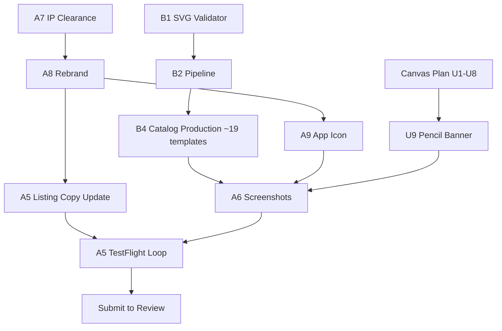

# Sable v1 — App Store Submission Plan

## Overview

This plan is the authoritative v1 submission scope after the 2026-04-17 grilling session. It does not re-describe the canvas-UX fixes (see plan 2) or Phase A submission hygiene (see plan 1) at unit granularity; it records the **scope and sequencing decisions** that change what "v1" means, adds the new units that the grilling surfaced, and demotes what moves to v1.1.

Where unit-level detail already exists in plan 1 or plan 2, this plan links to it rather than duplicating.

## Scope-shaping decisions (locked)

| # | Decision | Implication |
| - | -------- | ----------- |
| D1 | **Paid up-front, $9.99. No IAP.** | No StoreKit, no paywall, no receipt-validation surface. "No Data Collected" privacy label stays defensible. Positioning subtitle must justify price. |
| D2 | **Apple Pencil required.** | `drawingPolicy = .pencilOnly` stays. Finger-only reviewer risk mitigated via D3. Canvas-plan "first-tap-on-finger-only" urgency drops. |
| D3 | **App Review Notes + in-app Pencil-presence banner.** | New canvas-plan unit: dismissible banner explaining Pencil-only drawing. App Review Notes field drafted and filed. |
| D4 | **Rebrand to Sable** (provisional, pending USPTO TESS + App Store name-uniqueness check). Bundle ID `com.prateekranka.colorflow` stays internal. | Display name, listing copy, icon wordmark, in-app name references change. Fallback name queue: Ochre, Daub. |
| D5 | **DIY SwiftUI app icon.** Pencil-tip silhouette drawing a simple shape mark. Single accent color, dark background. | New icon unit. `ImageRenderer`-based, single direction, no external tools. |
| D6 | **Single icon for v1.** `CFBundleAlternateIcons` deferred to v1.1. | No alt-icon asset catalog entries. |
| D7 | **v1 catalog: ~30 templates** (11 existing + 19 new). | AI-assisted production via Google Gemini 2.5 Flash Image (Nano Banana). Promotes Phase B1 + B2 from "post-launch tooling" to v1-critical. |
| D8 | **Five catalog categories:** mandalas, animals, geometric/abstract, seasonal/holidays, landscapes/architecture. | Each category ≥ 4 templates. Mandalas can over-index (app's visual hero). |
| D9 | **Phase C (photo-to-template) demoted to v1.1.** | Removes CoreML model, Vision + Metal + CoreImage pipeline, `NSCameraUsageDescription`, memory-ceiling testing for 6GB iPads. Binary stays well under 200MB. |
| D10 | **Screenshots: catalog-only**, no photo-pipeline shots. | 13-inch + 12.9-inch iPad, landscape-primary, 6–10 per size. |
| D11 | **Screenshots: no caption overlay design work** (user lacks Figma/PS skills). | Raw-or-lightly-annotated simulator screenshots, deterministic capture via `xcrun simctl`. No marketing chrome. |
| D12 | **IP clearance audit (A7) added to Phase A.** | Trademark search for Sable. Audio inventory (verified empty). Font inventory (verified empty — system fonts only). |

## Out of scope for v1 (locked as deferred)

- Photo-to-template pipeline (Phase C) → v1.1.
- Scale-out to 50 / 100 templates → post-launch content cadence.
- StoreKit, IAP, subscriptions, paywall → future plan if ever.
- iPhone / Mac Catalyst layouts.
- Non-English localization.
- Ambient sound / audio (verified not present in repo today).
- iCloud / iCloud Drive project sync → v1.1+.
- Third-party analytics, attribution SDKs, telemetry.
- Alt-icons, app badging, widgets, Live Activities.
- Pencil Pro-specific features (barrel-roll, squeeze, hover) — user's device is regular Pencil.

## Device reality (locked)

- **Primary test device:** iPad A16 (11th-gen entry iPad), iPadOS 26.4.1, Apple Pencil (non-Pro).
- **Coverage gap:** Pencil iPads on iPadOS 17 / 18 cannot be hardware-validated. Simulator-only. Accept risk; plan 1 R2 matrix reframed to "Simulator for 17/18, real device for 26."
- **Coverage gap:** No non-Pencil-iPad testing needed — D2 makes Pencil required.

## Consolidated v1 unit list

Units are organized by existing plan where possible. New units introduced by this plan are marked **[NEW]**.

### Phase A — Submission hygiene (plan 1 authoritative)

- A1 Submission audit → complete (see `docs/solutions/2026-04-app-store-submission-audit.md`). F-05 (test target) still open.
- A2 Privacy manifest + Info.plist → partial (see `docs/solutions/2026-04-privacy-manifest-audit.md`). Remove `NSCameraUsageDescription` from planned list (D9). Retain `NSPhotoLibraryAddUsageDescription` for export-to-Photos.
- A3 Release build hygiene → plan 1 authoritative (see `docs/solutions/2026-04-release-logging.md`).
- A4 Accessibility baseline → plan 1 authoritative (see `docs/solutions/2026-04-accessibility-baseline.md`).
- A5 Store Connect + TestFlight loop → plan 1 authoritative. Listing copy (`docs/app-store/listing-copy.md`) must be updated for Sable + Pencil-required + $9.99 + catalog count.
- **A6 [NEW] Screenshots unit.** Dedicated sub-tree below.
- **A7 [NEW] IP clearance audit.** Dedicated sub-tree below.
- **A8 [NEW] Rebrand to Sable.** Dedicated sub-tree below.
- **A9 [NEW] App icon DIY.** Dedicated sub-tree below.

### Phase B — Catalog (promoted from "tooling" to v1-critical)

- B1 SVG spec + validator → plan 1 authoritative. **v1 blocker.**
- B2 Host-side catalog pipeline → plan 1 authoritative, **scoped to Nano Banana input** per D7. **v1 blocker.**
- B3 Freelancer brief → deferred post-launch (D7 = AI-assisted, not freelancer).
- **B4 [MODIFIED] v1 catalog production.** 19 new templates via Nano Banana → vectorize → validate. Cull rate budget: 60–80 raw candidates for 19 keepers. ~6 per category, mandalas over-indexed OK.

### Phase C — Photo-to-template

- **All units demoted to v1.1.** No v1 work. `docs/plans/2026-04-14-001-feat-app-store-readiness-roadmap-plan.md` remains the authoritative design doc for when C resumes.

### Plan 2 — Canvas UX

- U1–U6 unchanged, still v1 priority.
- **U2 (post-onboarding default tool)** urgency downgraded per D2 — Pencil users' first tap draws, but the mismatch between onboarding ("Tap to Fill") and default (.pencil) still merits the fix. Keep.
- **U5 (first-use hint)** still useful. Consider pairing with D3's Pencil-presence banner so the overlay system is shared.
- **U7–U8** still v1 priority (brushes + stay-in-the-lines) — both are part of the "$9.99 feels premium" story.
- **New U9 [NEW]: Pencil-presence banner** (D3).

---

## [NEW] Unit A6 — Screenshots

**Goal:** Produce and upload the App Store screenshots required for iPad-only submission. Catalog-only content, no photo-pipeline imagery.

**Deliverables:**
- 6–10 screenshots for 13-inch iPad (2064×2752 or 2752×2064, landscape primary).
- 6–10 screenshots for 12.9-inch iPad Pro (2048×2732 or 2732×2048, landscape primary).
- Captured deterministically via `xcrun simctl io <udid> screenshot` against a seeded simulator state.
- First three screenshots carry the sale: (a) finished hero template with Pencil visible, (b) canvas mid-stroke with toolbar, (c) catalog/library showing variety across 5 categories.
- Remaining screenshots show UI detail: color picker, stay-in-the-lines toggle, export flow, gallery, settings.
- No caption overlays (D11). Raw simulator output only.

**Files:**
- Create: `Scripts/screenshots/capture.sh` — driver that boots a named simulator, seeds a demo project, navigates each screen, calls `xcrun simctl io screenshot`, names outputs deterministically.
- Create: `Scripts/screenshots/seed.json` — deterministic app state (specific template pre-filled, specific brush, specific zoom, specific gallery contents).
- Create: `docs/app-store/screenshots/13-inch/` and `docs/app-store/screenshots/12-9-inch/` with ordered PNGs.
- Modify: `docs/app-store/screenshots/README.md` to document the capture command and the seed state.

**Approach:**
- One demo project is hand-colored into a state that "looks like what a 30-minute session produces" — this goes in `seed.json` as a serialized `Project` + `ProjectPaintState`.
- A debug-only launch arg `-screenshotMode` sets the simulator to the seeded state on launch, bypassing onboarding and populating the gallery. Gate with `#if DEBUG` so Release builds ignore it.
- Landscape orientation primary. Portrait optional for 2–3 shots (settings sheet, library).
- Every shot is reproducible: same simulator UDID, same seed, same frame.

**Dependencies:**
- B4 catalog production must be ≥ 50% complete so the gallery shots show variety, not 11 templates.
- Canvas-plan U1–U5, U7, U8 must be landed so the UI in screenshots reflects the shipping experience.
- A8 rebrand must be complete so no "ColorFlow" artifacts leak into screenshots.

**Verification:**
- Running `Scripts/screenshots/capture.sh` on a clean simulator produces 12–20 PNGs in under 5 minutes.
- Uploaded to App Store Connect without resizing errors.
- First three shots, viewed at thumbnail size, legibly communicate "premium Pencil coloring with 30+ templates."

---

## [NEW] Unit A7 — IP clearance audit

**Goal:** Confirm no trademark or licensing conflicts block submission. Produce an auditable record.

**Deliverables:**
- Create: `docs/solutions/2026-04-ip-clearance.md` capturing:
  - **Name audit.** USPTO TESS search results for "Sable" in classes 9 (software) and 41 (entertainment). App Store name-uniqueness check. Google search top hits. Verdict + fallback queue (Ochre, Daub).
  - **Audio audit.** Repo scan for `.mp3 / .wav / .m4a / .aac`. Current state: **empty.** Re-verify before submission.
  - **Font audit.** `project.yml` + `Assets.xcassets` scan for bundled fonts. Current state: **empty** (system fonts only). Re-verify before submission.
  - **Image audit.** Any bundled raster imagery (splash, onboarding heroes in `ColorFlow/Views/Onboarding/Heroes/` — new untracked dir). Each image's source and license documented.
- Create: `docs/solutions/2026-04-ip-clearance.md` is the single source of truth. Store Connect intake references it.

**Dependencies:** None — runs at any time. Best run before A8 rebrand so fallback names are known.

**Verification:**
- All three (or four) audits marked ✅ or ❌ with citations. If Sable fails TESS, fallback name locked before A8 starts.

---

## [NEW] Unit A8 — Rebrand to Sable

**Goal:** Transition all user-facing "ColorFlow" references to "Sable." Bundle ID unchanged (internal continuity).

**Files (expected surface — audit during unit):**
- Modify: `ColorFlow/Info.plist` — `CFBundleDisplayName` → "Sable" (or remove and let `CFBundleName` default). `CFBundleName` may remain "ColorFlow" internally or change; decide during unit.
- Modify: `project.yml` — `PRODUCT_NAME` if currently "ColorFlow." Check.
- Modify: `docs/app-store/listing-copy.md` — all copy retargeted to Sable, Pencil-required, $9.99 positioning, ~30 templates.
- Modify: `ColorFlow/Views/Onboarding/**` — any hardcoded "ColorFlow" in onboarding copy.
- Modify: Any `About` / `Settings` screen copy.
- Modify: `README.md` — project overview retargeted.
- Grep: `git grep -i "colorflow"` — triage every hit, replace where user-visible, keep where internal (class names, bundle ID, file paths).

**Approach:**
- Grep sweep first, categorize each hit as user-visible vs internal, patch user-visible.
- Do **not** rename files, class names, module names — keeps git history clean, keeps bundle ID valid, avoids xcodegen churn.
- Repo directory name optional (`Cowork/ColorFlow` → `Cowork/Sable`); defer to user preference.

**Dependencies:** A7 complete (Sable confirmed available or fallback chosen).

**Verification:**
- `git grep -i "colorflow"` shows only internal hits (class names, bundle ID, file paths) — no user-visible strings remain.
- App launches on simulator showing "Sable" on home screen icon caption.
- Listing copy reflects Sable branding end-to-end.

---

## [NEW] Unit A9 — App icon (DIY, SwiftUI-rendered)

**Goal:** A single, production-quality app icon matching the Sable brand direction. Pencil-tip silhouette drawing a simple shape mark, single accent color, dark background.

**Deliverables:**
- Create: `ColorFlow/Views/Branding/IconView.swift` — SwiftUI view, 1024×1024 logical frame, pure geometric shapes + `Path` drawing. No raster assets.
- Create: `Scripts/icons/render.swift` — command-line Swift script that instantiates `IconView`, renders via `ImageRenderer`, and writes all required sizes (20/29/40/76/83.5 @1x+2x + 1024 marketing) to the asset catalog.
- Modify: `ColorFlow/Assets.xcassets/AppIcon.appiconset/` — rendered PNGs replace current assets. `Contents.json` updated if size names change.
- Modify: `ColorFlow/Resources/AppIcon.svg` — replace with the new direction or delete (the SwiftUI view is now the source of truth).

**Design direction (locked):**
- Pencil-tip silhouette (Pencil 1st-gen style — cylindrical, single accent-color tip).
- Pencil is drawing a simple shape mark mid-stroke. Candidate shapes: open circle, letter-S curve, simple crescent. Pick during implementation.
- Dark background (consistent with app's `#1C1C1E` or a dedicated icon-only deeper black).
- Single accent color for the pencil-tip color trail. AppTheme.accent (`#7B5FE8`) or an icon-specific warm tone.
- No wordmark ("Sable" text on the icon itself). Apple handles caption separately.
- Corner radius: let Apple handle it — do not pre-round; iOS applies the mask.

**Approach:**
- Iterate in SwiftUI Preview at 1024×1024, validate at small sizes by downsampling live.
- Final render to all sizes via `ImageRenderer.uiImage` with `scale = 1.0` (the sizes *are* the scales), then write out.
- Test at 40pt (spotlight) and 20pt (notifications) — the silhouette must remain legible. If it doesn't, simplify.

**Dependencies:** A8 complete so the brand direction ("Sable") is locked. A7 complete so Sable is confirmed.

**Verification:**
- App launches on simulator with the new icon visible in home screen.
- Icon legible at 20pt (notifications badge territory).
- Icon renders correctly against both light and dark wallpapers (iOS home screen customization).
- Asset catalog validation passes App Store Connect intake.

---

## Critical path + sequencing

**Estimated critical path to submission:**

| Block | Estimate |
| ----- | -------- |
| A7 IP clearance | 1–2 hours |
| A8 Rebrand | 0.5 day |
| A9 Icon (DIY) | 1–2 days |
| B1 + B2 tooling | 1–2 weeks |
| B4 Catalog production (19 templates via Nano Banana) | 1 week |
| Canvas plan U1–U9 | already in flight, assume 1 week remaining |
| A6 Screenshots | 1–2 days |
| A5 Listing + TestFlight loop | 2–3 days |
| **Total elapsed** | **~4–5 weeks** assuming some parallelization |

## Open risks

- **Sable fails TESS.** Fallback to Ochre → Daub. Adds 0.5 day if discovered late.
- **Nano Banana output cull rate > 70%.** 80+ raw candidates needed for 19 keepers. Absorbable in the 1-week production budget but tight.
- **DIY icon quality ceiling.** If the SwiftUI icon does not look premium at 40pt and 20pt, backstop is a $100 Fiverr commission with 3-day turnaround. Decision point: end of A9 day 2.
- **iPadOS 17 / 18 regression undetected.** Only tested in Simulator. If App Review runs on a physical iPad Pro running 17.x, a device-specific regression ships. Mitigation: none in-scope; accept the risk.
- **Catalog validator rejects too many AI outputs.** If B2's post-processor is too strict, 19 becomes unattainable. Mitigation: tune validator against first 5 successful templates; loosen if needed without weakening SVG contract.
- **Pencil-presence banner (D3 / U9) UX missteps.** Banner too aggressive → feels broken. Banner too subtle → reviewer misses it. Mitigation: iterate during TestFlight loop.

## Supersession note

- Plan 1 (`2026-04-14-001-…roadmap`) remains authoritative for **Phase A detail, Phase B tooling design, and Phase C design** (the latter now as a v1.1 reference).
- Plan 2 (`2026-04-15-001-fix-canvas-ux…`) remains authoritative for **canvas-UX unit detail** — with the caveat that D2 (Pencil required) changes the urgency weighting of U2 and U5, and adds U9.
- This plan (`2026-04-17-001-…sable-v1-submission`) is authoritative for **v1 scope, sequencing, and the new A6/A7/A8/A9 units.**
